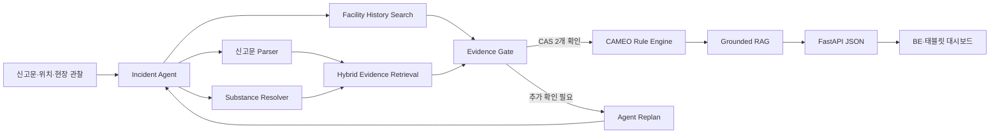

# 케미체크119 AI

### 소방안전 빅데이터 기반 화학사고 현장대응 에이전트

> 불완전한 화학사고 신고를 구조화하고, 사고물질·시설물질 후보와 공식 대응 근거를 탐색한 뒤,
> 확인된 물질 조합의 충돌 위험을 검토하는 배포형 AI 서비스입니다.

[](pyproject.toml)
[](docs/API.md)
[](docs/DEPLOYMENT.md)
[](docs/EVALUATION.md)

- **참가 부문:** [제6회 소방안전 빅데이터 활용 및 아이디어 경진대회](https://www.bigdata-119.kr/bbs/view?bbsctt_id=571) · 서비스 개발 부문
- **AI 스택:** Incident Agent · Resolver Fine-tuning · Hybrid Retrieval · Grounded RAG · CAMEO Rule Engine · FastAPI

## 무엇을 해결하는가

소방대원은 출동 중 신고문, 시설의 과거 화학물질 이력, MSDS, 물질 간 반응성을 짧은 시간에
함께 확인해야 합니다. 케미체크119는 이 과정을 하나의 AI 파이프라인과 통합 API로 연결합니다.

```text
화학사고 신고
→ 신고문 구조화
→ 사고물질 후보 식별
→ 전국 시설 과거 이력 검색
→ MSDS·CAMEO 근거 검색
→ 현장 확인 정보 반영
→ 물질 충돌 규칙 검토
→ 근거가 연결된 대응 결과
→ BE·태블릿 대시보드
```

| 현장 문제 | 케미체크119의 해결 방식 |
|---|---|
| 구어체·오타가 포함된 신고 | 파서와 Resolver가 물질 표현·사고유형·설비를 구조화 |
| 물질명을 정확히 모르는 상황 | 상태·색상·냄새·용도로 복수 후보와 다음 확인 질문 생성 |
| 시설 내 다른 물질 정보 부족 | ICIS·PRTR 기반 전국 시설 과거 이력 후보 검색 |
| 대응 근거가 여러 문서에 분산 | KOSHA·CAMEO 문서를 하이브리드 검색하고 출처와 함께 반환 |
| 잘못된 물질 조합 판정 위험 | 확인된 CAS 두 개에만 CAMEO 충돌 규칙 실행 |
| 긴 분석을 화면에 표시하기 어려움 | FastAPI가 대시보드 전용 구조화 JSON으로 응답 |

[태블릿 대시보드 디자인 보기](https://www.figma.com/make/APHOgF5QNcsoucHMflVkY8/%EC%86%8C%EB%B0%A9-%EB%8C%80%EC%8B%9C%EB%B3%B4%EB%93%9C-%EB%94%94%EC%9E%90%EC%9D%B8?p=f&t=7kbKZoOyhlZz0tWB-0)

## AI 아키텍처



### 1. Incident Agent

`PLAN → ACT → OBSERVE → REPLAN` 루프로 현재 사고 상태를 관리합니다. 파서, 물질 검색,
시설 이력, 근거 검색, 확인 게이트, 충돌 규칙을 도구처럼 선택하고 다음 현장 행동을 제안합니다.

### 2. 신고문 구조화

사전·정규식·결정적 파서를 결합해 다음 필드를 추출합니다.

- 물질 표현과 역할
- 누출·화재·폭발 등 사고유형
- 시설·설비 표현
- 부정·추정·확정 상태
- 위치와 추가 확인 항목

### 3. 물질 Resolver·Discovery

정확한 CAS·표준명·동의어 검색과 문자 TF-IDF를 결합해 Top-K 후보를 생성합니다. 소방안전
빅데이터의 실제 사고 표현으로 Resolver를 적응학습했으며, 이름을 모를 때는 상태·색상·냄새·
용도 프로필로 물질을 탐색합니다.

### 4. Hybrid Retrieval·Grounded RAG

정확 검색, SQLite FTS5 BM25, 단어·문자 TF-IDF의 순위를 RRF로 결합합니다. Grounded RAG는
검색된 공식 문서와 CAMEO 규칙을 문장 단위 인용으로 연결하며, 인용 검증 실패 시 extractive
응답으로 자동 전환합니다.

### 5. Evidence Gate·CAMEO Rule Engine

용기 라벨, 현장 MSDS, 운송문서, 계측기 등으로 확인된 두 CAS만 충돌 규칙에 전달합니다.
위험등급과 반응성은 LLM이 아니라 CAMEO 반응성 그룹·호환성 규칙이 결정합니다. 이 구조로
검색·생성 모델의 역할과 안전 판정을 분리했습니다.

## 모델 및 데이터 성과

| 지표 | 결과 |
|---|---:|
| Resolver 잠금 평가셋 | 소방 사고 표현 419건 |
| Resolver Top-1 Accuracy | **0.3246 → 0.6706 (+34.60%p)** |
| 전국 화학사고 외부 평가 | 2021~2025년 442건 |
| 사고유형 Recall | **0.8376** |
| 물질명 언급 Recall | **0.8150** |
| 물질 카탈로그 | 약 **4,300개** |
| 관찰 기반 물질 프로필 | **749 CAS** |
| 전국 시설 과거 이력 | **17개 시·도 · 28,647개 시설** |
| 공식 근거 검색 인덱스 | 약 **5,858개 문서·절** |
| CAMEO 충돌 규칙 코어 | **CAS 6종 · 15조합** |
| 자동화 테스트 | **426개** |

평가 데이터, 분할 정책, 실패 사례와 재현 명령은 [모델 평가 문서](docs/EVALUATION.md)에서
관리합니다.

## 소방안전 빅데이터 활용

| 데이터 | AI 파이프라인 적용 | 구축 결과 |
|---|---|---:|
| [울산 화학사고별 유해물질 판단 정보](https://www.bigdata-119.kr/goods/goodsInfo?goods_mng_sn=5) | 사고 기록의 물질명–CAS 표현을 Resolver 적응학습에 사용 | 유효 표현 1,530건 · 학습 표현 241개 추가 |
| [울산광역시소방본부 화학물 정보](https://www.bigdata-119.kr/goods/goodsInfo?goods_mng_sn=21) | 상태·색상·냄새·용도 기반 Discovery 프로필 생성 | 카탈로그 연결 749 CAS |

### 결합한 공식 데이터

| 데이터 | 제공기관 | AI 활용 |
|---|---|---|
| 물질안전보건자료 조회 서비스 | 한국산업안전보건공단 | 유해성·보호구·누출 대응 근거 검색 |
| 화학 사고 정보 | 화학물질안전원 | 전국 사고 기반 신고문 파서 외부 평가 |
| ICIS 화학물질 통계정보 | 화학물질안전원 | 표준 물질명·CAS와 시설 과거 취급 후보 |
| PRTR 배출·이동량 정보 | 화학물질안전원 | 시설별 과거 배출·이동 이력 보강 |
| CAMEO Chemicals | NOAA/EPA | 반응성 그룹·호환성 규칙·공식 근거 |

데이터 출처, 전처리, manifest와 버전 정책은 [데이터와 모델](docs/DATA_AND_MODEL.md)에서
확인할 수 있습니다.

## 대표 분석 결과

```text
입력
“○○전자 공장, 차아염소산나트륨 저장탱크 누출”

AI 처리
1. 누출 사고와 차아염소산나트륨 표현 추출
2. CAS 7681-52-9를 상위 물질 후보로 반환
3. 시설의 과거 취급물질 후보 검색
4. MSDS·CAMEO 공식 근거 카드 구성
5. 현장 확인이 필요한 두 물질과 확인 방법 제시
6. 확인된 CAS 조합에 CAMEO 충돌 규칙 실행
7. 위험등급·구체적 위험·우선 확인사항·인용 근거 반환
```

API 응답에는 `analysis_id`, 물질 후보, 확인 상태, 근거 카드, 충돌 검토, Agent workflow,
모델·데이터·규칙 버전이 함께 포함됩니다.

## FastAPI

백엔드는 통합 API 하나로 전체 AI 파이프라인을 실행할 수 있습니다.

```http
POST /api/v1/incidents/analyze
```

| 메서드 | 경로 | 기능 |
|---|---|---|
| `GET` | `/health/live` | 프로세스 생존 확인 |
| `GET` | `/health/ready` | artifact·인증·정책 준비 확인 |
| `GET` | `/api/v1/meta` | 모델·데이터·규칙 버전 조회 |
| `POST` | `/api/v1/incidents/analyze` | 통합 사고 분석 |
| `POST` | `/api/v1/agents/incidents/step` | Agent 도구 실행·재계획 |
| `POST` | `/api/v1/substances/resolve` | 물질명·CAS 후보 검색 |
| `POST` | `/api/v1/substances/discover` | 관찰 정보 기반 물질 탐색 |
| `POST` | `/api/v1/evidence/search` | 공식 대응 근거 검색 |
| `POST` | `/api/v1/facilities/candidates` | 시설 과거 이력 후보 검색 |
| `POST` | `/api/v1/conflicts/review` | 확인된 물질 조합 충돌 검토 |

## 빠른 시작

```bash
git clone https://github.com/chemicheck119/llm.git
cd llm

python3.11 -m venv .venv
source .venv/bin/activate
python -m pip install --upgrade pip
python -m pip install -e ".[dev]"

python -m pytest
chemiguard119 --help
```

artifact가 준비된 개발 환경에서는 API를 다음과 같이 실행합니다.

```bash
CHEMIGUARD119_ALLOW_ANONYMOUS=true chemiguard119-api

curl http://127.0.0.1:8000/health/ready
curl -X POST http://127.0.0.1:8000/api/v1/substances/resolve \
  -H "Content-Type: application/json" \
  -d '{"query":"아세톤","top_k":3}'
```

- Swagger UI: `http://127.0.0.1:8000/docs`
- 운영 API 인증: `X-API-Key`
- 전체 요청·응답 예시: [API 문서](docs/API.md)
- artifact 준비와 서버 배포: [배포 가이드](docs/DEPLOYMENT.md)

## 배포 구조

```text
GitHub Actions
→ 테스트·평가 회귀 검사
→ Docker 이미지 빌드
→ artifact checksum 검증
→ Cloud Run 후보 리비전 배포
→ readiness·통합 API smoke test
→ 트래픽 전환 또는 즉시 롤백
```

핵심 AI 경로는 CPU 서버에서 실행되며 LM Studio에 의존하지 않습니다. 외부 LLM은 선택적
Grounded RAG 계층으로 연결되고, 장애 시 Resolver·검색·규칙 엔진은 계속 동작합니다.

## 저장소 구조

```text
src/chemiguard119/   Agent·Resolver·Retriever·Rule Engine·FastAPI
tests/               단위·통합·계약·안전·배포 회귀 테스트
config/              별칭·CAMEO 매핑·근거 정책
data/evaluation/     공개 평가 입력·예측·지표
contracts/           OpenAPI·BE/BFF 연동 계약
examples/            CLI·API·백엔드 호출 예시
docs/                아키텍처·데이터·평가·배포 문서
scripts/             데이터 준비·학습·평가·artifact 도구
```

## 문서

- [아키텍처](docs/ARCHITECTURE.md) — Agent와 전체 처리 흐름
- [데이터와 모델](docs/DATA_AND_MODEL.md) — 데이터 출처·전처리·모델 역할
- [모델 평가](docs/EVALUATION.md) — 평가셋·지표·실패 사례·재현 방법
- [API](docs/API.md) — 요청·응답·오류 계약
- [FE·BE 연동](docs/FE_BE_HANDOFF.md) — 대시보드 DTO와 연동 체크리스트
- [배포](docs/DEPLOYMENT.md) — Docker·Cloud Run·Secret·롤백
- [운영](docs/OPERATIONS.md) — readiness·로그·장애 대응
- [안전 설계](docs/SAFETY_AND_LIMITATIONS.md) — Evidence Gate와 판정 정책

## Safety by Design

- **Candidate, not guess:** 모호한 물질은 하나로 단정하지 않고 Top-K 후보와 확인 질문을 반환합니다.
- **Evidence Gate:** 확인된 사고물질 CAS와 시설물질 CAS가 모두 있어야 충돌 규칙이 실행됩니다.
- **Deterministic risk:** 위험등급과 반응성은 CAMEO 규칙 엔진이 재현 가능하게 결정합니다.
- **Grounded generation:** 생성 계층은 검색된 공식 근거에 연결된 문장만 응답에 포함합니다.
- **Traceable output:** 모든 분석에 request ID와 모델·데이터·규칙 버전을 기록합니다.
- **Graceful fallback:** 외부 LLM 장애 시 검색·규칙·extractive 응답으로 자동 전환합니다.

케미체크119는 AI의 탐색 능력과 공식 화학 규칙의 재현성을 결합해, 출동 중 필요한 정보를
하나의 근거 중심 현장대응 흐름으로 제공합니다.
