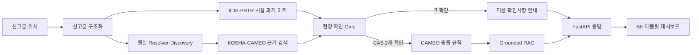

# 케미체크119

### 소방안전 빅데이터 기반 화학사고 현장대응 에이전트

> 출동 중 불완전한 신고에서 화학물질 후보를 찾고, 현장에서 확인된 물질과 공식 근거만으로
> 충돌 위험을 검토하는 소방 의사결정 보조 서비스입니다.

**참가 부문:** [제6회 소방안전 빅데이터 활용 및 아이디어 경진대회](https://www.bigdata-119.kr/bbs/view?bbsctt_id=571) · 서비스 개발 부문
**기술:** Python 3.11 · FastAPI · Docker · Google Cloud Run

케미체크119는 화학 반응을 생성형 AI가 추측하는 챗봇이 아닙니다. 검색 모델, 현장 확인
게이트, CAMEO 규칙 엔진, 근거 제한형 RAG를 결합해 **모르면 후보를 제시하고, 확인 전에는
판정을 멈추며, 결과에는 출처를 함께 반환**합니다.

> 현재 상태: `READY_WITH_DISCLOSED_LIMITATIONS` — 공모전 발표·시연은 가능하지만 실제
> 소방 현장 운영 승인을 받은 시스템은 아닙니다.

## 서비스 한눈에 보기

| 구분 | 내용 |
|---|---|
| 사용자 | 출동 중인 소방대원과 현장 지휘관 |
| 문제 | 비정형 신고, 시설물질 정보 공백, 물질 혼합 위험을 각각 찾아야 하는 부담 |
| 해결 | 신고 구조화 → 물질·시설 후보 → 현장 확인 → 충돌 규칙 → 공식 근거 제공 |
| 차별점 | 확인된 CAS 두 개가 있어야 충돌 규칙을 실행하는 Evidence Gate |
| 결과 | 후보, 확인 상태, 위험등급, 구체적 위험, 대응 근거와 버전이 포함된 JSON |

대표 사용 흐름은 다음과 같습니다.

```text
상황실 신고 접수
→ 출동 중 MDT·태블릿에서 신고 확인
→ AI가 물질·시설 후보와 공식 근거 탐색
→ 현장에서 라벨·MSDS·운송문서로 두 물질 확인
→ 확인된 CAS 조합만 충돌 검토
→ 근거가 붙은 대응 결과와 확인 기록 저장
```

[태블릿 대시보드 디자인 보기](https://www.figma.com/make/APHOgF5QNcsoucHMflVkY8/%EC%86%8C%EB%B0%A9-%EB%8C%80%EC%8B%9C%EB%B3%B4%EB%93%9C-%EB%94%94%EC%9E%90%EC%9D%B8?p=f&t=7kbKZoOyhlZz0tWB-0)

## 데이터 활용

### 소방안전 빅데이터 플랫폼

| 데이터 | 실제 활용 | 결과 |
|---|---|---|
| [울산 화학사고별 유해물질 판단 정보](https://www.bigdata-119.kr/goods/goodsInfo?goods_mng_sn=5) | 사고 기록의 물질명–CAS 표현으로 Resolver 적응학습 | 1,868행에서 유효 표현 1,530건 추출, 학습 표현 241개 추가 |
| [울산광역시소방본부 화학물 정보](https://www.bigdata-119.kr/goods/goodsInfo?goods_mng_sn=21) | 상태·색상·냄새·용도 기반 물질 Discovery 프로필 구축 | 원천 4,378행에서 카탈로그 연결 749 CAS |

화학물 정보 원본의 저장소 provenance는 소방청 공공데이터포털 주소이며, 동일 데이터 상품이
소방안전 빅데이터 플랫폼에도 등록돼 있습니다. 유해물질 판단 정보는 플랫폼 파일을 Resolver
학습 원천으로 직접 사용합니다.

### 결합한 공식 데이터

| 데이터 | 제공기관 | 용도 |
|---|---|---|
| 물질안전보건자료 조회 서비스 | 한국산업안전보건공단 | 유해성·보호구·누출 대응 근거 검색 |
| 화학 사고 정보 | 화학물질안전원 | 전국 사고 1,026건 기반 신고문 파서 외부 평가 |
| ICIS 화학물질 통계정보 | 화학물질안전원 | 표준 물질명·CAS 카탈로그와 업체 과거 취급 후보 |
| PRTR 배출·이동량 정보 | 화학물질안전원 | 업체 과거 배출·이동 이력 보강 |
| CAMEO Chemicals | NOAA/EPA | 물질 반응성 그룹·호환성 규칙과 공식 근거 |

ICIS·PRTR 기록은 **현재 재고가 아닌 과거 이력 후보**입니다. 배출량을 재고량이나 사고확률로
해석하지 않습니다. 데이터 출처·전처리·재배포 조건은
[데이터와 모델](docs/DATA_AND_MODEL.md)에서 확인할 수 있습니다.

## AI 파이프라인



| 구성요소 | 적용 기술 | 역할 |
|---|---|---|
| 신고문 구조화 | 사전·정규식·결정적 파서 | 물질 표현·사고유형·부정 표현 추출 |
| 물질 검색 | 정확 CAS·표준명·별칭 + 문자 TF-IDF | 오타·띄어쓰기 차이에서 Top-K 후보 생성 |
| 관찰 검색 | 상태·색상·냄새·용도 다중 필드 검색 | 물질명을 모를 때 복수 후보와 확인 질문 제공 |
| 근거 검색 | 정확 검색 + FTS5 BM25 + 단어·문자 TF-IDF + RRF | 관련 MSDS·CAMEO 문서 순위화 |
| 충돌 검토 | CAMEO 반응성 그룹·호환성 규칙 | 확인된 CAS 조합만 재현 가능하게 판정 |
| Grounded RAG | 문장별 출처 검증 + extractive fallback | 규칙과 검색 근거 안에서 대응 내용을 정리 |
| Incident Agent | `PLAN → ACT → OBSERVE → REPLAN` | 현재 상태에 필요한 도구와 다음 행동 선택 |

기본 경로는 외부 LLM 없이 작동합니다. LLM은 선택적으로 근거가 준비된 결과를 한 번
요약하며, 호출 실패나 인용 검증 실패 시 `FALLBACK_EXTRACTIVE`로 전환합니다. LM Studio는
로컬 실험 도구일 뿐 운영 필수 의존성이 아닙니다.

## 왜 일반 챗봇과 다른가

| 일반적인 생성형 챗봇 | 케미체크119 |
|---|---|
| 그럴듯한 물질 하나를 선택할 수 있음 | 모호하면 Top-K 후보를 반환하고 기권 |
| LLM이 화학 반응을 설명 | CAMEO 규칙이 판정하고 LLM은 근거 안에서만 요약 |
| 시설 이력을 현재 보유물질로 오인할 수 있음 | 과거 이력과 현장 확인 상태를 명시적으로 분리 |
| 모델 장애 시 전체 기능이 중단될 수 있음 | 외부 LLM 없이 검색·규칙·근거 조립 유지 |

## 구현 및 검증 현황

| 항목 | 현재 범위 | 해석 |
|---|---:|---|
| 물질 카탈로그 | 약 4,300개 | 물질명·CAS 후보 검색 범위 |
| 관찰 기반 프로필 | 749 CAS | 상태·색상·냄새·용도 기반 확인 전 후보 |
| 전국 시설 과거 이력 | 17개 시·도·28,647개 시설 | 현재 재고가 아닌 ICIS·PRTR 이력 후보 |
| 근거 검색 인덱스 | 약 5,858개 문서·절 | 상세 KOSHA 근거는 현재 9종 |
| 공개 검증 충돌 범위 | CAS 6종·15쌍 | 지원 조합만 결정론적으로 검토 |
| 전국 사고 외부 평가 | 2021~2025년 442건 | 사고유형 Recall 0.8376, 물질명 언급 Recall 0.8150 |
| Resolver 적응학습 | 2020년 잠금 표현 419건 | Top-1 0.3246 → 0.6706 |
| 자동 테스트 | 426개 | 단위·통합·API·안전·배포 계약 회귀 |
| 배포 | 서울 Cloud Run preview | readiness 확인 후 트래픽 전환 검증 |

Resolver 향상은 과거 소방 기록에 등장한 표현 검색에 한정됩니다. 전국 사고 평가 원천에는
CAS 정답과 실제 신고 음성 전사가 없으므로 위 수치를 현장 정확도나 사고 대응 성공률로
해석하지 않습니다. 지표 정의와 실패 사례는 [모델 평가](docs/EVALUATION.md)에 공개합니다.

## 대표 시연

```text
입력: “○○전자 공장, 차아염소산나트륨 저장탱크 누출”

1. 사고물질·누출 유형 후보 추출
2. 차아염소산나트륨 / CAS 7681-52-9 후보 제시
3. 시설의 염산 과거 취급 이력 후보 표시
4. 라벨·현장 MSDS로 두 CAS 확인 요청
5. 확인 후 CAMEO 충돌 규칙 실행
6. 예상 대응·우선 확인사항·공식 출처 제공
```

이 시나리오의 위험 메커니즘은 CAMEO·CDC·ILO/WHO·UKHSA 공식 문서로 교차확인했습니다.
문헌은 물질 접촉 시 가능한 반응을 설명하지만 현장에 두 물질이 실제 존재하는지, 이미
혼합됐는지, 농도와 피해 반경이 얼마인지는 증명하지 않습니다.

## 빠른 시작

Python 3.11이 필요합니다.

```bash
git clone https://github.com/chemicheck119/llm.git
cd llm

python3.11 -m venv .venv
source .venv/bin/activate
python -m pip install --upgrade pip
python -m pip install -e ".[dev]"

python -m pytest
chemiguard119 --help
```

전체 API 실행에는 검증된 SQLite DB와 Resolver·Retriever artifact가 필요합니다. 이 저장소는
대용량 원천과 생성 artifact를 직접 공개하지 않습니다. 준비 방법은
[배포 가이드](docs/DEPLOYMENT.md)를 참고하세요.

artifact가 준비된 개발 환경에서는 다음처럼 실행합니다.

```bash
CHEMIGUARD119_ALLOW_ANONYMOUS=true chemiguard119-api

curl http://127.0.0.1:8000/health/ready
curl -X POST http://127.0.0.1:8000/api/v1/substances/resolve \
  -H "Content-Type: application/json" \
  -d '{"query":"아세톤","top_k":3}'
```

- Swagger UI: `http://127.0.0.1:8000/docs`
- 운영 환경: 모든 `/api/v1/*` 요청에 `X-API-Key` 필요
- API 요청·응답 예시: [API 문서](docs/API.md)

## 주요 API

| 메서드 | 경로 | 역할 |
|---|---|---|
| `GET` | `/health/live` | 프로세스 생존 확인 |
| `GET` | `/health/ready` | artifact·인증·정책 준비 상태 확인 |
| `POST` | `/api/v1/incidents/analyze` | 통합 사고분석 |
| `POST` | `/api/v1/agents/incidents/step` | Agent 도구 선택·재계획 |
| `POST` | `/api/v1/substances/resolve` | 물질명·CAS 후보 검색 |
| `POST` | `/api/v1/substances/discover` | 관찰 정보 기반 물질 후보 검색 |
| `POST` | `/api/v1/evidence/search` | 공식 대응 근거 검색 |
| `POST` | `/api/v1/facilities/candidates` | 시설의 과거 취급 이력 후보 검색 |
| `POST` | `/api/v1/conflicts/review` | 확인된 두 물질의 충돌 검토 |

## 프로젝트 구조

```text
src/chemiguard119/   모델·Agent·FastAPI
tests/               단위·통합·계약·안전 테스트
config/              별칭·CAMEO 연결·근거 정책
data/evaluation/     공개 가능한 평가 입력·결과
contracts/           OpenAPI·대시보드 BFF 계약
examples/            API·BFF 요청과 응답 예시
docs/                설계·평가·연동·배포 문서
scripts/             데이터 준비와 평가 도구
```

## 문서

- [아키텍처](docs/ARCHITECTURE.md) — 전체 구성과 처리 흐름
- [데이터와 모델](docs/DATA_AND_MODEL.md) — 출처·전처리·모델 역할
- [모델 평가](docs/EVALUATION.md) — 지표·평가셋·실패 사례
- [API](docs/API.md) — 요청·응답·오류 계약
- [FE·BE 연동](docs/FE_BE_HANDOFF.md) — 대시보드 DTO와 적용 체크리스트
- [배포](docs/DEPLOYMENT.md) — artifact·Secret·Docker·롤백
- [공식근거 보증](docs/COMPETITION_ASSURANCE.md) — 공모전 제출 근거와 금지 표현
- [안전 및 한계](docs/SAFETY_AND_LIMITATIONS.md) — 지원 범위와 해석 경계
- [현재 상태](docs/PROJECT_STATUS.md) — 완료·부분 완료·미완료 현황

## 안전 원칙

- 물질 후보는 현장 확인 전 충돌 규칙에 사용할 수 없습니다.
- 위험등급은 확률이 아닌 CAMEO 기반 서수 등급이며 `is_probability=false`입니다.
- 공개 근거 파일럿 결과는 `expert_reviewed=false`, `decision_support_only=true`입니다.
- 시설 이력은 현재 재고·수량·저장 위치를 확정하지 않습니다.
- 지원하지 않는 물질이나 근거가 없는 조합은 추측하지 않고 기권합니다.

케미체크119의 모든 출력은 의사결정 보조 정보입니다. 물질과 시설 상태를 현장에서 확인하고,
최종 결정은 현장 지휘관이 수행합니다.
