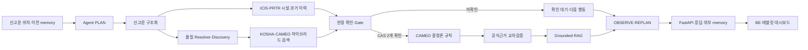

# 케미체크119 — Evidence-Gated Chemical Incident Agent

> **출동 중 흩어진 화학사고 정보를 한 흐름으로 정리하고, 확인된 물질과 공식근거만으로
> 충돌 위험을 검토하는 소방 현장 의사결정 보조 AI**

`공모전 시연: READY_WITH_DISCLOSED_LIMITATIONS` · `서울 Cloud Run preview 배포` ·
`실제 현장 운영: BLOCKED`

케미체크119는 일반적인 화학사고 챗봇이 아닙니다. 신고문에서 물질 후보를 찾고, ICIS·PRTR의
시설 과거 이력을 탐색하고, KOSHA·CAMEO 근거를 검색한 뒤, **현장에서 확인된 두 CAS만**
결정론적 충돌 규칙에 전달합니다. RAG는 그 결과를 공식근거 안에서 짧게 설명하고 FastAPI가
대시보드에 구조화된 JSON을 제공합니다.

하나의 거대한 LLM이 화학 반응을 추측하지 않습니다. 검색 모델·현장 확인 gate·CAMEO 규칙·
근거 검증·선택형 LLM을 역할별로 분리한 **Evidence-Gated Hybrid Incident Agent**입니다.

## 1. 30초 프로젝트 이해

| 질문 | 케미체크119의 답 |
|---|---|
| 누가 사용하나요? | 상황실 지령을 받고 이동 중인 소방대원과 현장 지휘관 |
| 언제 사용하나요? | 출동 중 신고 내용을 정리할 때, 현장 도착 후 라벨·MSDS를 확인할 때 |
| 어떤 문제를 줄이나요? | 신고문·MSDS·업체 이력·혼합 위험을 따로 찾는 시간과 인지 부담 |
| AI는 무엇을 하나요? | 신고 구조화, 물질 후보·공식근거 검색, 도구 실행 순서와 다음 확인사항 관리 |
| AI가 하지 않는 것은? | 미확인 물질 확정, 화학 반응 추측, 위험 확률 생성, 현장 명령 |
| 최종 결과는? | 후보·확인 상태·충돌 등급·구체적 위험·대응 근거·버전이 포함된 API 응답 |

서비스의 핵심 흐름은 단순합니다.

```text
신고 접수
→ 물질·시설 후보 정리
→ 업체 과거 취급 이력과 공식근거 탐색
→ 현장에서 사고물질·시설물질 확인
→ 확인된 CAS 2개만 충돌 검토
→ 근거가 붙은 대응 카드 제공
→ 전체 대응기록 저장
```

## 2. 왜 필요한가

화학사고 현장에는 세 가지 정보 공백이 동시에 존재합니다.

1. **신고 내용은 비정형입니다.** 물질명이 부정확하거나 제품명·설비·주소가 한 문장에
   섞여 들어옵니다.
2. **시설의 현재 재고를 바로 알기 어렵습니다.** 공개 ICIS·PRTR는 현재 보유물질이 아니라
   과거 취급·배출·이동 이력이므로 후보 탐색에만 사용할 수 있습니다.
3. **두 물질의 충돌은 확인된 정체가 필요합니다.** 이름 검색 Top-1만으로 반응을 판단하면
   잘못된 CAS 하나가 전체 대응을 왜곡할 수 있습니다.

케미체크119는 이 공백을 생성형 답변으로 덮지 않습니다. **모르면 후보를 보여주고, 확인 전에는
판정을 멈추며, 확인 후에는 공식 규칙과 근거를 함께 제시**합니다. 서비스 타당성과 실제 사고
근거는 [서비스 타당성 판단](docs/SERVICE_VALIDITY.md)에 정리했습니다.

## 3. 공모전 심사 포인트

| 평가 관점 | 강점 | 구현 증거 |
|---|---|---|
| 문제 적합성 | 출동 중 정보 취합과 물질 혼합 위험 확인이라는 구체적 현장 문제 해결 | 통합 사고분석 API·태블릿 BFF 계약 |
| AI 기술성 | 규칙 파서, 하이브리드 검색, Grounded RAG, 상태 기반 도구 에이전트 결합 | `src/chemiguard119/`와 자동 테스트 |
| 안전성 | 모호하면 기권하고 확인된 CAS 두 개 전에는 충돌 결과를 숨김 | confirmation gate·fail-closed 검증 |
| 근거성 | 위험 주장마다 CAMEO와 독립 공식기관 출처·문서 위치·미증명 조건 반환 | Reference Assurance registry |
| 실현 가능성 | 외부 LLM 없이 CPU 실행 가능, FastAPI·Docker·CI·Cloud Run 배포 | 서울 preview·readiness·이미지 digest |
| 확장성 | 17개 시·도 업체 이력과 분리된 데이터·모델·규칙 artifact | manifest·checksum·전국 범위 감사 |

참신성은 “더 큰 LLM”이 아니라 **AI가 확신할 수 있는 범위를 증거로 잠그는 구조**에 있습니다.
최신 AI 기술을 사용하되 안전 판정을 생성형 모델에 맡기지 않은 것이 프로젝트의 핵심 설계
결정입니다.

## 4. 전체 AI 파이프라인



실행 에이전트는 `PLAN → ACT → OBSERVE → REPLAN`을 제한된 6개 도구로 반복합니다. 이전
결과와 확인 대기 상태는 BE가 저장한 `memory`로 이어지며, 새 관찰이 없으면 분석을 반복하지
않습니다. 기존 10단계 workflow·8개 도구 상태는 이 실행 기록을 태블릿에 읽기 쉽게 보여주는
UI projection입니다. 전국 출동 위치·현재 위치·서버 길찾기 계약은
[전국 현장대응 에이전트와 지도 연동](docs/OPERATIONS_AGENT_AND_MAP.md)에 있습니다.

## 5. 적용된 AI 기술

| 구성요소 | 적용 기술 | 프로젝트에서의 역할 |
|---|---|---|
| 신고문 구조화 | 사전·정규식·결정적 파서, 선택형 LLM | 업체·물질·사고유형·설비 후보 추출 |
| 물질 Resolver | 정확 CAS·표준명·별칭 + 문자 TF-IDF | 오타·띄어쓰기·표현 차이에서 Top-K 후보 생성 |
| 관찰 Discovery | 상태·색상·냄새·용도 다중 필드 검색 | 물질명을 모를 때 공개자료 기반 복수 후보 제공 |
| 근거 Retriever | 정확 CAS·제목 + FTS5 BM25 + 단어·문자 TF-IDF + RRF | 질문과 관련된 MSDS·CAMEO section 순위화 |
| Selective Abstention | 미등록·모호성·점수 격차·확인 상태 gate | 근거가 부족하면 억지로 하나를 확정하지 않음 |
| 충돌 Rule Engine | CAMEO 반응성 그룹·호환성 규칙 | 확인된 CAS 조합의 위험을 재현 가능하게 검토 |
| Grounded RAG | 인용 허용목록·문장별 source ID·extractive fallback | Rule과 검색 근거 밖의 문장 생성을 차단 |
| Incident Agent | 외부 memory·정책 planner·도구 registry·bounded replan | 상태에 따라 분석·확인 요청·안전 재검증·결과 제시 도구를 선택 |
| Reference Assurance | 독립기관 그룹·claim 단위 검증·SHA-256 | 근거 수준과 문헌으로 증명하지 못한 조건 공개 |
| MLOps | manifest·checksum·readiness·Docker·CI/CD | 데이터·모델·규칙 버전을 고정하고 롤백 가능하게 배포 |

기본 운영 경로는 외부 LLM이 없어도 작동합니다. `CHEMIGUARD119_RAG_MODE=llm`일 때만 검토가
완료된 결과를 OpenAI-compatible LLM이 최대 한 번 요약합니다. 호출 실패, 출처 누락 또는
위험등급 불일치가 발생하면 `FALLBACK_EXTRACTIVE`로 전환합니다. LM Studio는 로컬 실험
도구일 뿐 운영 필수 의존성이 아닙니다.

## 6. 일반 챗봇과 무엇이 다른가

| 일반적인 화학 챗봇 | 케미체크119 |
|---|---|
| 질문을 받으면 바로 문장을 생성 | 후보 탐색→현장 확인→규칙→근거 순서를 강제 |
| 가장 그럴듯한 물질 하나를 선택 | 모호하면 Top-K를 반환하고 `UNRESOLVED`로 기권 |
| LLM이 위험 반응을 설명 | CAMEO 규칙이 판정하고 LLM은 근거 안에서만 요약 |
| 시설 이력을 현재 보유물질처럼 오인 가능 | `과거 취급 후보`, `현재 재고 미확인`을 계약에 고정 |
| 답변 근거가 링크 한두 개에 머묾 | claim별 출처·기관 수·문서 위치·registry hash 반환 |
| 모델 장애 시 전체 기능 중단 | 외부 LLM 없이도 검색·규칙·extractive 응답 유지 |
| 로컬 데모에 머물기 쉬움 | FastAPI·불변 Docker 이미지·Cloud Run·readiness 구현 |

이 구조를 **Evidence-Gated Hybrid Incident Agent**라고 정의합니다.

## 7. 실제 구현 규모와 검증 결과

| 항목 | 현재 값 | 정확한 의미 |
|---|---:|---|
| 물질 카탈로그 | 약 4,300개 | 물질명·CAS 후보 검색 범위 |
| 관찰 기반 프로필 | 749 CAS | 울산소방 원천 중 카탈로그와 연결된 성상 후보 |
| 전국 시설 범위 | 17개 시·도·28,647개 시설 | 현재 재고가 아닌 공개 과거 이력 검색 범위 |
| 시설 이력 후보 | 약 168,424행 | ICIS·PRTR 과거 취급·배출·이동 후보 |
| 검색 인덱스 | 약 5,858개 문서·section | KOSHA·CAMEO 검색 단위, 상세 KOSHA 근거는 현재 9종 |
| 공개 검증 충돌 범위 | CAS 6종·15쌍 | 지원 조합만 결정론적으로 검토 |
| 공식기관 교차확인 | 2쌍 | 독립 공식기관 3곳 이상이 같은 위험 메커니즘 지지 |
| CAMEO 단일체계 | 13쌍 | `PRIMARY_AUTHORITY_ONLY`로 화면에서 구분 |
| 자동 테스트 | 383개 | 단위·통합·API·안전·배포 계약 회귀 |
| 배포 | 서울 Cloud Run preview | 후보 0% smoke 후 100% 전환, readiness 확인 |

내부 21건 Resolver, 10건 legacy Retriever, 12건 section Retriever와 8건 E2E는 **작은 DRAFT
회귀셋**입니다. 현장 정확도나 상용 성능으로 주장하지 않습니다. 정답 없는 50건 E2E 후보는
미확인 Rule 실행 0건과 출력 계약을 검사하는 preflight로만 사용합니다. 공모전 제출 기준과
금지 표현은 [공모전 공식근거 보증](docs/COMPETITION_ASSURANCE.md)에 있습니다.

## 8. 대표 시연 시나리오

```text
입력
  “○○전자 공장, 차아염소산나트륨 저장탱크 누출”

1. Parser      → 시설·사고물질·누출 유형 후보 추출
2. Resolver    → 차아염소산나트륨 / CAS 7681-52-9 후보
3. Facility    → 해당 시설의 염산 과거 취급 이력 후보 표시
4. Field Gate  → 용기 라벨·현장 MSDS로 두 CAS 확인 요청
5. Rule Engine → 산 접촉 시 유독성 염소가스 발생 위험 검토
6. RAG         → 예상 대응·우선 확인사항·공식 출처를 카드로 정리
7. Record      → 대화·확인·판정·근거를 하나의 대응기록으로 저장(BFF 계약, 실제 연동 예정)
```

이 대표 조합은 CAMEO·CDC·ILO/WHO·UKHSA의 공식문서 5개와 독립기관 그룹 4개가 연결된
`REFERENCE_TRIANGULATED`입니다. 문헌은 **접촉 시 발생 가능한 메커니즘**을 증명하지만 현장에
두 물질이 실제 존재하는지, 이미 혼합됐는지, 농도와 피해 반경이 얼마인지는 증명하지 않습니다.

## 9. 현재 준비 상태

| 단계 | 판정 | 남은 조건 |
|---|---|---|
| AI 모델·FastAPI | 공개 근거 파일럿 구현 완료 | 지원 데이터와 물질쌍 지속 확대 |
| Docker·CI·Cloud Run preview | 구현·배포 완료 | 실제 운영용 데이터 재배포 승인 필요 |
| 공모전 발표·시연 | `READY_WITH_DISCLOSED_LIMITATIONS` | 근거 수준·지원 범위·한계를 화면에 표시 |
| FE·BE 실제 연동 | 부분 완료 | 배포 API를 대상으로 소비자 계약·기록저장 종단간 시험 |
| 제한된 현장 파일럿 | `BLOCKED` | 독립 locked 평가·사용성·부하·장애 시험 |
| 실제 현장 운영·상용 | `BLOCKED` | 기관 승인·책임체계·운영 데이터·모니터링 |

현재 충돌 검토 정책은 `PUBLIC_SOURCE_PILOT_V1`이며 모든 결과에
`expert_reviewed=false`, `decision_support_only=true`가 포함됩니다. 위험도는 확률이 아닌
CAMEO 기반 서수 등급으로 `is_probability=false`입니다. 시설 이력은 현재 재고·수량·저장
위치를 의미하지 않습니다.

## 10. 처음 보는 용어

| 용어 | 뜻 |
|---|---|
| CAS 번호 | 화학물질을 구분하는 국제 등록 번호 |
| Resolver | 입력한 이름을 물질·CAS 후보로 연결하는 검색 모델 |
| Retriever | 저장된 공식 근거 중 질문과 관련된 내용을 찾는 검색 계층 |
| RAG | 찾은 근거와 Rule 결과만 이용해 출처가 붙은 설명을 만드는 계층 |
| CAMEO | NOAA가 제공하는 화학물질 반응성·대응 정보 체계 |
| Artifact | 전처리·학습으로 생성된 SQLite DB와 모델 파일 |
| 현장 확인 Gate | 사고물질과 시설물질을 각각 확인하기 전 충돌 결과를 내지 않는 규칙 |
| Reference Assurance | 위험 주장을 지지하는 공식기관 수와 미증명 조건을 기록하는 계층 |
| 현장대응 에이전트 | 현재 사고 상태를 관찰해 필요한 도구를 선택하고 결과에 따라 다시 계획하는 상태 머신 |

## 11. 5분 빠른 시작: artifact가 없을 때

Python 3.11이 필요합니다. 이 과정은 저장소의 코드와 테스트를 확인하며 대용량 모델
artifact는 필요하지 않습니다.

```bash
git clone https://github.com/chemicheck119/llm.git
cd llm

python3.11 -m venv .venv
source .venv/bin/activate
python -m pip install --upgrade pip
python -m pip install -e ".[dev]"

python -m pytest
chemiguard119 --help
```

테스트가 통과하면 API 계약과 핵심 모델 로직을 개발할 준비가 된 것입니다. 다만 전체 CLI와
API를 실행하려면 다음 네 artifact가 필요합니다.

```text
artifacts/
├── chemiguard119.sqlite
├── resolver.joblib
├── retriever.joblib
└── runtime_manifest.json
```

이 저장소에는 대용량 원천 데이터와 생성 artifact를 직접 커밋하지 않습니다. 검증된 bundle은
팀의 GitHub Actions 실행 결과 또는 승인된 내부 전달 경로에서 받아야 합니다. 아직 공개 Release
다운로드 주소는 제공하지 않습니다.

## 12. 전체 실행: artifact가 있을 때

bundle을 저장소의 `artifacts/`에 풀고 설정 파일이 `config/`에 있는지 확인합니다.

```bash
source .venv/bin/activate
chemiguard119 doctor --json
```

`doctor`는 runtime artifact뿐 아니라 재학습용 원천 CSV 8개도 함께 검사합니다. artifact만
받은 개발 환경에서는 `final_csv_count=0`과 `NEEDS_SETUP`이 표시될 수 있으며, 이 경우 API
실행 가능 여부는 아래 `/health/ready` 결과로 판단합니다.

개발 환경에서만 익명 접근을 명시적으로 허용해 API를 실행할 수 있습니다.

```bash
CHEMIGUARD119_ALLOW_ANONYMOUS=true chemiguard119-api
```

기본값 `CHEMIGUARD119_RAG_MODE=extractive`는 외부 모델 없이 공식 근거를 짧게 조립합니다.
LM Studio로 생성형 요약까지 시험하려면 Developer 서버에서 모델을 로드한 뒤 다음처럼 실행합니다.

```bash
export CHEMIGUARD119_RAG_MODE=llm
export CHEMIGUARD119_RAG_BASE_URL=http://127.0.0.1:1234/v1
export CHEMIGUARD119_RAG_MODEL='LM-Studio에-표시된-모델-ID'
CHEMIGUARD119_ALLOW_ANONYMOUS=true chemiguard119-api
```

LLM 호출이 실패하거나 인용 검증을 통과하지 못하면 API 오류 대신
`grounded_rag.status=FALLBACK_EXTRACTIVE`를 반환합니다.

다른 터미널에서 확인합니다.

```bash
curl http://127.0.0.1:8000/health/live
curl http://127.0.0.1:8000/health/ready
```

- Swagger UI: `http://127.0.0.1:8000/docs`
- OpenAPI JSON: `http://127.0.0.1:8000/openapi.json`

staging·production에서는 익명 접근이 차단되며 API Key와 artifact 신뢰 기준점이 필요합니다.
[배포 가이드](docs/DEPLOYMENT.md)를 먼저 확인하세요.

## 13. 첫 API 요청 보내기

가장 단순한 물질 후보 검색부터 확인합니다.

```bash
curl -X POST http://127.0.0.1:8000/api/v1/substances/resolve \
  -H "Content-Type: application/json" \
  -d '{"query":"아세톤","top_k":3}'
```

등록되지 않은 제품명이나 현장 속칭을 임의의 물질로 확정하지 않습니다. 공식 물질명·CAS로
식별할 수 없는 입력은 `UNRESOLVED` 또는 확인이 필요한 퍼지 후보로 남기고, 현장 라벨이나
MSDS 확인을 요청합니다.

물질명을 모를 때는 구별되는 관찰 정보를 두 가지 이상 입력합니다.

```bash
curl -X POST http://127.0.0.1:8000/api/v1/substances/discover \
  -H "Content-Type: application/json" \
  --data @examples/api/material_discovery_request.json
```

응답은 후보와 공개자료 출처를 제공하지만 물질을 확정하지 않습니다. 대원이 용기 라벨·현장
MSDS 등으로 CAS와 현장 존재를 확인해야 충돌 검토에 사용할 수 있습니다.

사고 분석은 먼저 현장 확인 정보 없이 후보만 요청합니다.

```bash
curl -X POST http://127.0.0.1:8000/api/v1/incidents/analyze \
  -H "Content-Type: application/json" \
  --data @examples/api/incident_unconfirmed_request.json
```

이 응답에서는 `confirmation_gate.all_required_confirmed=false`이며 충돌 등급이 제공되지
않습니다. 백엔드가 인증된 현장 확인 레코드 두 개를 만든 뒤 다시 요청합니다.

```bash
curl -X POST http://127.0.0.1:8000/api/v1/incidents/analyze \
  -H "Content-Type: application/json" \
  --data @examples/api/incident_confirmed_request.json
```

운영 API를 호출할 때는 모든 `/api/v1/*` 요청에 다음 헤더를 추가합니다.

```text
X-API-Key: 배포-Secret으로-주입한-키
```

전체 요청·응답 계약은 [API 문서](docs/API.md)에 있습니다.

## 14. CLI로 확인하기

전국 시설 과거 이력 범위는 다음처럼 확인합니다.

```bash
chemiguard119 coverage
chemiguard119 coverage --json
```

다음 명령은 artifact가 준비된 뒤 실행할 수 있습니다.

```bash
# 물질명·CAS·화학식 후보 검색
chemiguard119 resolve "아세톤"

# 물질명을 모를 때 관찰 정보로 후보와 출처 검색
chemiguard119 discover "무색 투명하고 박하 냄새가 나는 휘발성 액체"

# 임의 신고문을 전체 파이프라인으로 실행
chemiguard119 incident "황산 저장탱크에서 누출 중이며 옆 창고에 아세톤이 있습니다."

# 공식 근거 검색
chemiguard119 search "차아염소산나트륨 산 접촉"

# 신고문 구조화
chemiguard119 parse "염산 저장탱크에서 누출 중입니다."

# 실제 사고 분석 경로의 확인 gate·기권·충돌 규칙 회귀검사
chemiguard119 evaluate-e2e --evaluation-profile INTERNAL_REGRESSION

# E2E 50건 독립 검수 후보 생성·시트 내보내기·병합·사전점검
chemiguard119 e2e-review --help

# JSON으로 출력
chemiguard119 --json resolve "황산"
```

명령 전체는 다음으로 확인합니다.

```bash
chemiguard119 --help
chemiguard119 incident --help
```

## 15. 원천 데이터에서 artifact 만들기

이 단계는 일반 API 사용자에게 필요하지 않습니다. 데이터 담당자나 모델 릴리스 담당자가
검증된 원천 데이터 bundle을 보유한 경우에만 실행합니다.

```bash
chemiguard119 pipeline \
  --data-dir data/raw \
  --db artifacts/chemiguard119.sqlite \
  --resolver-model artifacts/resolver.joblib \
  --retriever-model artifacts/retriever.joblib \
  --config-dir config \
  --report-dir outputs/modeling \
  --include-hash \
  --json
```

기본 profile은 CI용 `INTERNAL_REGRESSION`이며 결과를 현장 정확도로 사용할 수 없습니다.
실제 production bundle은 `PILOT_REVIEWED`를 요구하고 DRAFT 평가행이 하나라도 있으면
manifest 생성을 차단합니다.

```bash
chemiguard119 evaluate \
  --only retriever \
  --evaluation-profile INTERNAL_REGRESSION \
  --json

# 현재 저장소의 DRAFT 평가셋에서는 의도적으로 exit code 1
chemiguard119 evaluate \
  --only retriever \
  --evaluation-profile PILOT_REVIEWED \
  --json
```

파이프라인은 다음 순서로 실행됩니다.

```text
audit → prepare → train resolver → train retriever → evaluate → release manifest
```

공모전 시연 물질과 다음 공식 데이터 수집 대상을 정할 때는 별도의 지원 물질
우선순위 파이프라인을 사용합니다. 이 순위는 위험 확률이나 업체의 현재 재고 확률이
아닙니다.

```bash
python scripts/data/build_support_material_priority.py --help
```

자세한 입력과 해석 기준은
[지원 물질 우선순위 문서](docs/SUPPORT_MATERIAL_PRIORITY.md)에 있습니다.
우선순위 CAS를 KOSHA 공식 API에서 수집하는 방법은
[KOSHA 수집·검토 문서](docs/KOSHA_COLLECTION.md)에 있습니다. 수집 결과를 곧바로
운영 데이터로 승인하지 않으며, API 키는 환경변수로만 주입합니다.

원천 bundle은 Git에 넣지 않고 GitHub Actions Secret을 통해 릴리스 작업에만 복원합니다.
Secret 이름과 bundle 계약은 [배포 가이드](docs/DEPLOYMENT.md)에 설명되어 있습니다.

## 16. API 엔드포인트

| 메서드 | 경로 | 역할 |
|---|---|---|
| `GET` | `/health/live` | 프로세스 생존 확인 |
| `GET` | `/health/ready` | artifact·인증·정책 준비 상태 확인 |
| `GET` | `/api/v1/meta` | 서비스·스키마·정책 메타데이터 |
| `POST` | `/api/v1/incidents/analyze` | 전체 사고 분석 파이프라인 |
| `POST` | `/api/v1/agents/incidents/step` | 상태 기반 도구 선택·재계획과 외부 memory 반환 |
| `POST` | `/api/v1/substances/discover` | 관찰 정보 기반 확인 전 물질 후보·출처 검색 |
| `POST` | `/api/v1/substances/resolve` | 물질 후보 검색 |
| `POST` | `/api/v1/evidence/search` | 공식 근거 검색 |
| `POST` | `/api/v1/facilities/candidates` | 시설의 과거 취급 이력 후보 검색 |
| `POST` | `/api/v1/conflicts/review` | 현장 확인된 두 물질 충돌 검토 |

## 17. 공개 근거 파일럿 정책

`PUBLIC_SOURCE_PILOT_V1`은 “전문가가 승인했다”는 뜻이 아닙니다. 공개 CAMEO 페이지에서
CAS·물질 형태를 직접 대조해 provenance로 기록한 매핑만 사용하며, 런타임은 그 형식·출처·
일관성이 정책과 맞을 때만 파일럿 스크리닝을 허용합니다.

파일럿 결과에는 다음 정보가 포함됩니다.

- `policy_mode=PUBLIC_SOURCE_PILOT_V1`
- `expert_reviewed=false`
- 매핑과 근거의 URL·버전·확인 시각
- `risk_scale.is_probability=false`
- `risk_scale.probability_percent=null`
- `human_confirmation_required=true`

전문가 승인은 서비스 실행의 선행조건이 아니지만, 두 물질의 현재 현장 존재 확인은 별개의
필수 게이트입니다. 공개 자료에 없는 물질쌍은 결과를 추측하지 않고 미분류 상태로 반환합니다.

## 18. 데이터 사용 범위

| 데이터 | 파이프라인에서 하는 일 | 해석하면 안 되는 것 |
|---|---|---|
| ICIS | 4,300개 일반 물질 카탈로그와 별칭 후보 | 현장에 실제 존재한다는 확정 |
| 울산소방 화학물정보 | 749 CAS의 상태·색상·냄새·용도 후보 검색 | 물질 확정·울산 전용 서비스라는 주장 |
| KOSHA MSDS | 현재 스냅샷의 상세 근거 9종 검색 | 전체 4,300개에 상세 MSDS가 있다는 주장 |
| ICIS·PRTR 시설 이력 | 업체명·지역 기반 과거 취급 후보 | 현재 재고·보유량·저장 위치 |
| CAMEO | 반응성 그룹 기반 충돌 스크리닝 | 사고 발생 확률 또는 현장 명령 |

상세한 전처리와 모델 설명은 [데이터와 모델](docs/DATA_AND_MODEL.md)을 참고하세요.
대시보드 버튼·저장·파서 역할은
[대시보드 적용 흐름](docs/DASHBOARD_FLOW.md)에 정리했습니다.
현재 FE 코드와 연결할 정확한 BFF 경로·타입·적용 체크리스트는
[FE·BE 연동 인수인계서](docs/FE_BE_HANDOFF.md)를 확인하세요.

## 19. 프로젝트 구조

주요 기술 스택은 Python 3.11, FastAPI, Pydantic, SQLite FTS5, scikit-learn, joblib,
Pytest, Ruff, Docker, GitHub Actions와 Google Cloud Run입니다. 외부 LLM은
OpenAI-compatible API 계약으로 선택 연결합니다.

```text
.
├── src/chemiguard119/   # 모델·파이프라인·API 소스
├── tests/               # 단위·계약·안전 불변조건 테스트
├── config/              # 물질 별칭·CAMEO crosswalk·근거 보증 정책
├── data/evaluation/     # 작은 내부 평가 입력
├── examples/api/        # API 요청 예시
├── examples/bff/        # FE용 BE/BFF 성공·실패 계약 예시
├── contracts/           # 모델 API·대시보드 BFF OpenAPI와 TypeScript 타입
├── docs/                # 설계·연동·배포 문서
├── scripts/             # 데이터 준비와 선택 실험 도구
├── Dockerfile           # 외부 artifact mount 방식
├── Dockerfile.bundle    # 검증된 artifact 포함 이미지
├── compose.yaml
└── pyproject.toml
```

공개 패키지명은 `chemiguard119`로 유지하지만 서비스명은 **케미체크119**입니다.

## 20. 개발과 테스트

```bash
python -m pytest
chemiguard119 evaluate --only resolver
python -m ruff check src tests scripts
python -m ruff format --check src tests scripts
python -m compileall -q src scripts
python -m pip check
```

변경 전에는 [기여 가이드](CONTRIBUTING.md)를 읽고, API 스키마·정책·문서를 함께
수정해 주세요.

## 21. 배포 개요

운영 배포는 Python 3.11과 다음 신뢰 기준점을 사용합니다.

- `openssl rand -hex 32`로 생성한 64자리 hex 또는 동등한 43자리 base64url API Key
- `runtime_manifest.json`의 SHA-256인 `CHEMIGUARD119_RUNTIME_MANIFEST_SHA256`
- manifest를 생성한 40자리 commit인 `CHEMIGUARD119_GIT_COMMIT`
- 빌드·독립 검수 단계에서만 사용하는 별도
  `CHEMIGUARD119_RELEASE_ATTESTATION_HMAC_KEY`(실행 서버 주입 금지)
- 충돌 정책 `CHEMIGUARD119_RULE_POLICY=PUBLIC_SOURCE_PILOT_V1`
- 읽기 전용 SQLite·모델·config
- `GET /health/ready` 기반 readiness 확인

`staging`과 `production`은 같은 무결성·인증 gate를 적용하며, 외부 bind mount가 아닌
`Dockerfile.bundle` 불변 이미지와 registry digest로 배포합니다.

자세한 절차는 [배포 가이드](docs/DEPLOYMENT.md)를 확인하세요.

## 22. 문서 안내

- [아키텍처](docs/ARCHITECTURE.md): 구성요소와 전체 처리 흐름
- [API](docs/API.md): 백엔드·프론트 연동 계약
- [FE·BE·AI 연동](docs/BACKEND_INTEGRATION.md): 저장소별 책임, 호출·병합 순서
- [FE·BE 인수인계](docs/FE_BE_HANDOFF.md): 실제 FE 코드 차이, BFF DTO, 적용 체크리스트
- [데이터와 모델](docs/DATA_AND_MODEL.md): 출처, 전처리, 모델 역할과 평가
- [모델 평가](docs/EVALUATION.md): 지표 정의, 기준선, 실패 원인 분리
- [평가 V2](docs/EVALUATION_V2.md): 21·10·6의 출처, 상용 타당성, 공모전 AI 고도화 기준
- [E2E 독립 검수](docs/E2E_REVIEW_GUIDE.md): 정답 없는 50건 후보를 이중 검수 locked set으로 만드는 절차
- [공식근거 교차검증](docs/EVIDENCE_ASSURANCE.md): 주장별 공식 출처, 독립기관 수, fail-closed 정책
- [공모전 공식근거 보증](docs/COMPETITION_ASSURANCE.md): 사람 검수 없이 사용할 제출 기준과 금지 표현
- [최종 브리핑](docs/BRIEFING.md): 발표문, 최신 AI 주제, 수치와 상용 준비 판정
- [배포](docs/DEPLOYMENT.md): artifact, Secret, Docker, CI/CD, 롤백
- [Cloud Run 무중단 배포](docs/CLOUD_RUN_DEPLOYMENT.md): 서울 스테이징, OIDC, Blue/Green 전환
- [공모전 통합 preview](docs/PREVIEW_DEPLOYMENT.md): 비운영 artifact 이미지와 백엔드 인증 연동
- [운영](docs/OPERATIONS.md): 구조화 로그, 요청 추적, 장애 확인 절차
- [현재 상태](docs/PROJECT_STATUS.md): 실제 완료 범위, 재현 결과, P0~P3 기술 부채
- [안전 및 한계](docs/SAFETY_AND_LIMITATIONS.md): 반드시 지켜야 할 해석 경계
- [기여 가이드](CONTRIBUTING.md): 브랜치, 테스트, 커밋 규칙

## 23. 자주 묻는 질문

### 총 모델 호출은 하나인가요?

항상 한 번은 아닙니다. 일반 사고 분석은 `POST /api/v1/incidents/analyze`, 물질명을 모를
때는 별도 `POST /api/v1/substances/discover`를 사용합니다. 현장 확인 뒤 충돌 검토를 위해
`incidents/analyze`를 다시 호출할 수 있습니다. 기본 모드는 외부 LLM 없이 Resolver·Retriever·
Rule Engine과 extractive 요약을 실행합니다. `CHEMIGUARD119_RAG_MODE=llm`일 때만 두 CAS
확인과 Rule 완료 후 선택한 LLM을 최대 한 번 호출합니다.

### 서버에 LM Studio를 설치해야 하나요?

아니요. 기본 운영 경로는 FastAPI, SQLite, scikit-learn 모델, 결정적 규칙 엔진과 extractive
요약만 사용합니다. LM Studio는 선택적인 로컬 RAG 실험 도구이며, 배포 시에는 같은
OpenAI-compatible 계약의 서버 LLM 또는 외부 API로 바꿀 수 있습니다.

### 전문가 검토가 없으면 충돌 기능을 사용할 수 없나요?

아니요. `PUBLIC_SOURCE_PILOT_V1`에서 공개 출처로 검증된 스크리닝을 실행할 수 있습니다.
다만 응답은 항상 `expert_reviewed=false`이며 결과를 전문가 승인 또는 현장 명령으로 표현하면
안 됩니다.

대표 차아염소산나트륨–염산 조합은 여러 공식기관 근거가 같은 위험 메커니즘을 지지하는지
자동 점검합니다. 이 값은 `REFERENCE_TRIANGULATED`이지 “전문가 승인”이 아닙니다.

### 업체별 보유 물질을 정확히 알 수 있나요?

아니요. ICIS·PRTR에서 확인되는 과거 취급 이력을 후보로 제시할 뿐입니다. 현재 존재 여부는
현장 라벨, 현장 MSDS, 운송 문서 등으로 다시 확인해야 합니다.

### 위험도가 백분율인가요?

아니요. CAMEO 기반 서수 등급이며 `is_probability=false`입니다. 백분율로 변환하거나 사고
확률처럼 표시하지 않습니다.

---

케미체크119의 모든 출력은 의사결정 보조 정보입니다. 물질과 시설 상태를 현장에서 확인하고,
최종 결정은 현장 지휘관이 수행합니다.
