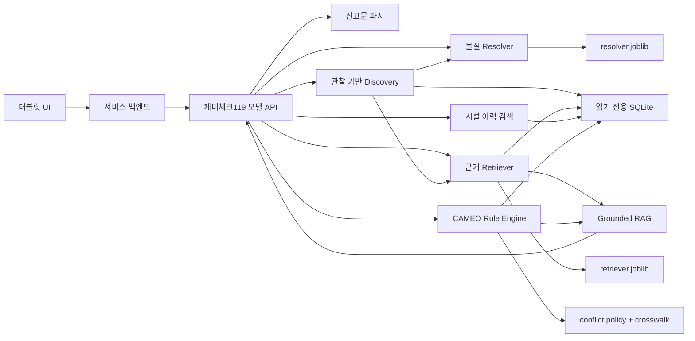
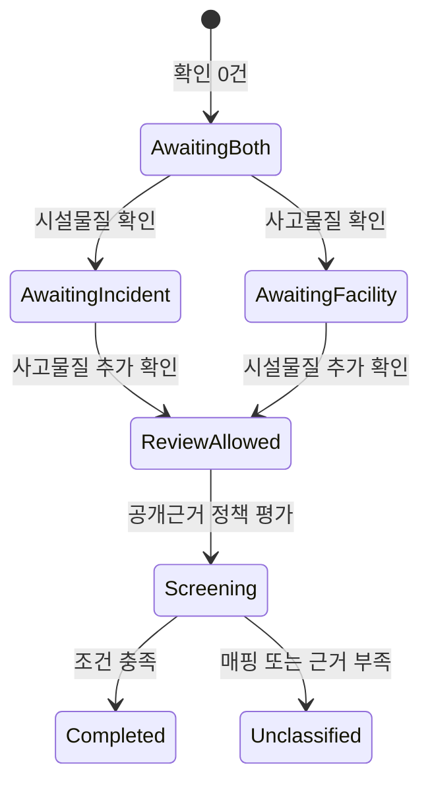
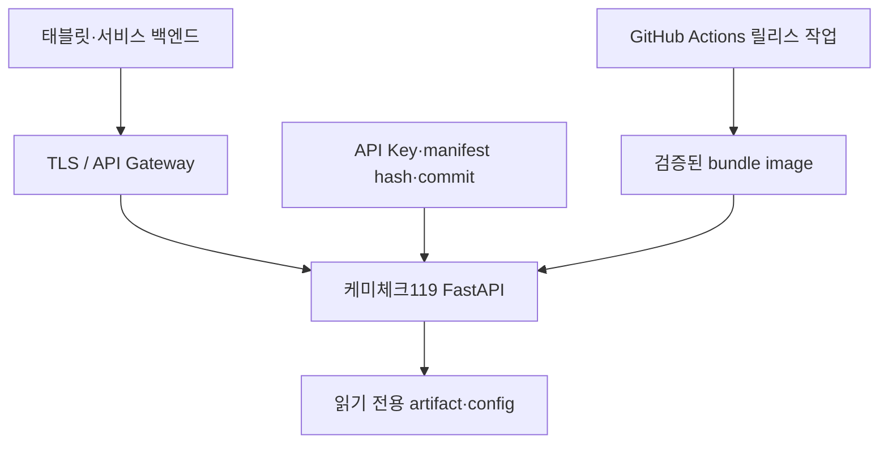

# 케미체크119 AI·모델 API 아키텍처

## 1. 문서 목적

이 문서는 케미체크119에서 AI·모델 API가 맡는 범위, 구성요소 사이의 데이터 흐름, 안전
게이트와 배포 경계를 설명합니다. API 필드 자체는 [API 문서](API.md), 데이터 출처와 모델
상세는 [데이터와 모델](DATA_AND_MODEL.md)을 참고합니다.

## 2. 시스템 경계

이 저장소가 담당하는 일은 다음과 같습니다.

- 신고문에서 물질 표현과 상황 표현을 제한적으로 구조화
- 물질명·CAS·화학식으로 물질 후보 검색
- 상태·색상·냄새·용도 관찰로 확인 전 물질 후보와 출처 검색
- KOSHA·CAMEO 공식 근거 검색
- 업체명·주소로 공개된 과거 취급 이력 후보 검색
- 현장에서 확인된 두 물질의 CAMEO 충돌 스크리닝
- 완료된 Rule 결과와 공식 근거만 인용하는 짧은 RAG 요약
- 전국 지도·출동 상태와 실제 도구 실행 단계를 관리하는 결정론적 현장대응 에이전트
- 사고 분석 결과를 통합 응답으로 조립하고 각 API의 안전 불변조건 검증

지도·이동·에이전트 계약의 쉬운 설명과 FE·BE 적용 순서는
[전국 현장대응 에이전트와 지도 연동](OPERATIONS_AGENT_AND_MAP.md)에 정리했습니다.

이 저장소가 담당하지 않는 일은 다음과 같습니다.

- 사용자·소방대원 인증과 권한 관리
- 현장 확인 레코드의 원본 보관
- 사고 기록 CRUD와 장기 보존
- 지도·풍향·확산 반경 계산
- 업체의 현재 재고 확정
- 현장 대응 명령 또는 최종 의사결정

인증된 대원의 신원과 `confirmation_id` 원본은 서비스 백엔드가 관리합니다. 모델 API는
백엔드가 전달한 확인 레코드의 형식과 역할을 검증한 뒤 사용합니다.

## 3. 전체 구성



백엔드는 모델마다 별도 HTTP 호출을 할 필요가 없습니다. 사고 분석에는
`POST /api/v1/incidents/analyze`를 호출하고, API 내부 오케스트레이터가 필요한 단계를
순서대로 실행합니다. 검색 화면처럼 독립 기능이 필요한 경우에만 보조 엔드포인트를 사용합니다.

## 4. 런타임 구성요소

| 구성요소 | 주요 파일 | 역할 | 위험 판정 권한 |
|---|---|---|---|
| API 경계 | `src/chemiguard119/api.py` | 인증, 요청 검증, 응답 조립, health check | 없음 |
| 운영 관측 | `src/chemiguard119/observability.py` | 민감정보를 제외한 JSON 요청 완료 로그 | 없음 |
| API 스키마 | `src/chemiguard119/api_models.py` | Pydantic 요청·응답 계약 | 없음 |
| 사고 오케스트레이터 | `src/chemiguard119/pipeline.py` | 각 단계를 순서대로 실행 | 게이트 통과 시 Rule 호출만 허용 |
| 현장대응 에이전트 | `src/chemiguard119/operations.py` | 도구 실행 상태·다음 행동·지도 이동 계약 조립 | 없음 |
| 전국 범위 감사 | `src/chemiguard119/coverage.py` | 시설 과거 이력의 시·도·시설·CAS 범위 계산 | 없음 |
| 신고문 파서 | `src/chemiguard119/incident.py` | 물질 표현·역할·상황 구조화 | 없음 |
| Resolver | `src/chemiguard119/resolver.py` | 물질·CAS 후보 검색과 공유 exact span 경계 검사 | 없음 |
| Discovery | `src/chemiguard119/discovery.py` | 정확 식별과 성상 FTS를 합쳐 후보별 출처 검색 | 없음 |
| Retriever | `src/chemiguard119/retrieval.py` | 공식 근거의 하이브리드 검색 | 없음 |
| 시설 이력 검색 | `src/chemiguard119/facility.py` | 과거 취급 이력 후보 조회 | 없음 |
| Rule Engine | `src/chemiguard119/rules.py` | CAMEO 그룹 호환성 lookup | 공개 근거 파일럿 스크리닝 |
| Grounded RAG | `src/chemiguard119/rag.py` | Rule·공식 근거를 문장별 출처와 함께 요약, 실패 시 extractive fallback | 없음 |
| 전처리 | `src/chemiguard119/preprocessing.py` | 원천 CSV를 SQLite·학습 입력으로 변환 | 없음 |
| 릴리스 검증 | `src/chemiguard119/release.py` | manifest·해시·버전 검증 | 없음 |
| E2E 평가기 | `src/chemiguard119/e2e_evaluation.py` | 실제 사고 분석 상태 전이·기권·확인 gate 회귀 | 없음 |

## 5. 사고 분석 순서

### 5.1 1차 요청: 후보 탐색

1. 백엔드가 신고 원문, 위치, 검토 중인 대응을 전송합니다.
2. API가 길이, 좌표 쌍, 식별자 형식을 검증합니다.
3. 결정적 파서가 신고문에서 사고물질·시설물질 표현을 찾습니다.
4. Resolver가 각 표현에 대한 CAS 후보를 반환합니다.
5. Retriever가 관련 KOSHA·CAMEO 근거를 검색합니다.
6. 위치의 업체명이나 주소가 있으면 시설 과거 이력을 검색합니다.
7. 현장 확인 두 건이 없으므로 Rule Engine은 실행하지 않습니다.
8. API는 필요한 다음 확인 항목과 함께 대기 상태를 반환합니다.

신고문에 정확한 CAS가 적혀 있어도 그것만으로 현장 존재가 확인된 것은 아닙니다. Resolver
결과는 항상 후보이며 `rule_eligible=false`입니다.

파서와 Resolver는 문장 안의 정확 별칭을 찾을 때 같은 원문 span matcher를 사용합니다.
별칭 양옆에 다른 한글·영숫자가 붙으면 exact로 취급하지 않습니다. 이 경계가 없으면
`염산염`을 `염산`으로 오인해 염산 CAS 문서만 검색할 수 있으므로, 불확실한 경우 CAS
힌트를 보류하는 쪽을 선택합니다.

### 5.2 현장 확인

서비스 백엔드는 인증된 사용자의 확인 행위를 기록하고 다음 정보를 모델 API에 전달합니다.

- 서로 다른 `confirmation_id`
- 유효한 CAS 번호
- `INCIDENT` 또는 `FACILITY` 역할
- `CONFIRMED_PRESENT` 상태
- 라벨, 현장 MSDS, 운송 문서 등 확인 근거
- 시간대가 포함된 확인 시각

모델 API는 사용자 인증 시스템을 직접 운영하지 않으므로 `confirmation_id`를 임의 문자열로
생성해 주지 않습니다.

### 5.3 2차 요청: 충돌 스크리닝

사고물질과 시설물질의 확인 레코드가 모두 있으면 다음 단계가 실행됩니다.

1. 두 CAS의 형식과 체크디지트 검증
2. 두 확인 ID와 역할이 서로 다른지 검증
3. `PUBLIC_SOURCE_PILOT_V1` 정책 로드
4. 운영 crosswalk에서 두 CAS의 CAMEO 연결 조회
5. `PUBLIC_SOURCE_VERIFIED`와 검증 방법·출처 조건 확인
6. 두 물질의 모든 CAMEO 반응성 그룹 조합 조회
7. 가장 보수적인 서수 등급 선택
8. 출처·매핑 provenance와 `expert_reviewed=false` 추가
9. 완료된 Rule과 검색 근거만 Grounded RAG에 전달
10. LLM 사용 시 문장별 `source_id`와 위험등급 일치 검사
11. 실패 시 공식 근거 extractive 요약으로 전환
12. 응답 안전 불변조건 검증

Grounded RAG는 신고 원문을 외부 모델에 보내지 않고, 이미 검색된 공식 문서 발췌와 Rule
결과만 전달합니다. 위험등급은 Rule Engine만 결정합니다. 두 CAS가 확인되지 않았거나 Rule이
미분류이면 RAG도 실행하지 않습니다.

공개 근거 조건을 만족하면 Rule 결과는 `SCREENING_COMPLETED`, 범위는
`PUBLIC_SOURCE_CAMEO_SCREENING`입니다. 매핑이 없거나 검증 조건을 만족하지 않으면 임의로
등급을 생성하지 않고 미분류·검증 필요 상태를 반환합니다.

## 6. 두 현장 확인 게이트

게이트 정책명은 `TWO_AUTHENTICATED_ON_SITE_CONFIRMATIONS_REQUIRED`입니다.



게이트는 전문가 검토 여부와 다른 개념입니다.

- **현장 확인**: 해당 장소에 두 물질이 실제 존재하는지 확인하는 필수 조건
- **전문가 검토**: 파일럿 결과를 별도 검토했는지를 나타내는 provenance

`PUBLIC_SOURCE_PILOT_V1`은 전문가 승인 없이 실행되지만 현장 확인 게이트를 우회하지
않습니다.

## 7. 공개 근거 충돌 정책

정책은 `config/conflict_policy.json`에 선언되고 운영 crosswalk는
`config/cameo_crosswalk.csv`에서 관리합니다.

공개근거 스크리닝이 완료된 뒤 `Reference Assurance`가
`config/reference_assurance_registry.json`을 읽어 주장·CAS 물질쌍·예상 생성물·공식기관
URL을 대조합니다. 대표 조합처럼 독립 공식기관 3개 이상과 필수 근거 역할을 만족하면
`REFERENCE_TRIANGULATED`, 그렇지 않으면 `PRIMARY_AUTHORITY_ONLY`로 반환합니다. registry가
누락되거나 불변조건이 깨지면 Rule 결과는 `VERIFY_REQUIRED`로 닫히고 readiness도 실패합니다.
이 계층은 사람 전문가 승인이나 현장 검증을 대체하지 않습니다.

현재 원칙은 다음과 같습니다.

- 정책 ID: `PUBLIC_SOURCE_PILOT_V1`
- 허용 매핑 상태: `PUBLIC_SOURCE_VERIFIED`
- 필수 검증 방법: `EXACT_CAS_AND_FORM_ON_OFFICIAL_DATASHEET`
- 출처 제품: NOAA/EPA CAMEO Chemicals
- 직접 물질쌍 규칙: 사용하지 않음
- 전문가 검토: 필요하지 않음, 결과에는 `expert_reviewed=false`
- 확률 출력: 금지
- 최종 결정권자: 현장 지휘관

이 정책은 공개 CAMEO 원자료의 그룹 호환성을 조회하는 스크리닝입니다. 생성형 모델이 위험
등급을 쓰거나, 이름 유사도만으로 CAMEO 물질을 연결하지 않습니다.

## 8. 모델과 저장소

### 8.1 Resolver

문자 2~5-gram TF-IDF로 입력 문자열과 물질 별칭을 비교합니다. 정확한 CAS, 정확한 공식명,
모호한 별칭, 퍼지 후보를 구분합니다. 점수는 후보 정렬값일 뿐 위험도나 확률이 아닙니다.

### 8.2 Retriever

다음 순위를 결합합니다.

- 정확한 CAS·제목 일치
- SQLite FTS5 BM25
- 단어 1~2-gram TF-IDF
- 문자 3~5-gram TF-IDF
- Reciprocal Rank Fusion

확인된 CAS로 검색할 때는 다른 CAS의 문서를 섞지 않습니다. 해당 CAS 상세 문서가 없으면
`CAS_EVIDENCE_NOT_LOADED`를 반환합니다.

### 8.3 Discovery

정확한 명칭·CAS는 Resolver, 성상 관찰은 SQLite FTS5 BM25가 찾습니다. 상태·색상·냄새·
용도 중 최소 두 영역이 일치한 후보만 반환하고, 같은 CAS의 공식 근거를 연결합니다. 모든
후보는 현장 확인 전 상태이며 Rule 입력이 아닙니다.

### 8.4 Rule Engine

CAMEO 반응성 그룹과 호환성 표를 결정적으로 조회합니다. 결과 등급은 CAMEO 원자료를
서비스 UI에 맞게 매핑한 서수 등급이며 사고 확률 모델이 아닙니다.

### 8.5 LM Studio

LM Studio는 신고문 구조화 실험을 비교하기 위한 선택 백엔드입니다. 기본 파이프라인과 FastAPI
서버, Resolver, Retriever, Rule Engine은 LM Studio 없이 실행됩니다.

## 9. Artifact와 시작 과정

API 프로세스는 시작할 때 다음 파일을 한 번 로드합니다.

```text
artifacts/chemiguard119.sqlite
artifacts/resolver.joblib
artifacts/retriever.joblib
artifacts/runtime_manifest.json
```

SQLite는 읽기 전용·immutable 모드로 연결합니다. 운영 환경에서는 joblib 역직렬화 전에
manifest 자체의 외부 SHA-256, 각 artifact·config 해시, Git commit, Python·NumPy·
scikit-learn·joblib 버전을 검증합니다. 검증에 실패하면 runtime을 로드하지 않고 readiness가
실패합니다.

## 10. 배포 토폴로지



모델 API는 외부에 직접 노출하기보다 서비스 백엔드 또는 API Gateway 뒤에 둡니다. 로컬
개발 외에는 익명 접근을 허용하지 않습니다.

## 11. 실패 처리

| 실패 | 동작 |
|---|---|
| artifact 없음·손상 | API 시작은 가능하지만 runtime은 비활성, readiness `503` |
| API Key 없음·불일치 | fail-closed, `401` 또는 구성 오류 `503` |
| 요청 스키마 오류 | `422 INVALID_SCHEMA` |
| 잘못된 CAS | 입력 경계에서 차단 |
| 물질 후보 모호 | 여러 후보와 확인 필요 상태 반환 |
| 상세 근거 없음 | `CAS_EVIDENCE_NOT_LOADED`, 다른 CAS로 대체하지 않음 |
| 현장 확인 부족 | Rule 미실행, 필요한 확인 역할 반환 |
| 공개 검증 매핑 없음 | 미분류 상태, 등급 생성 안 함 |
| 출력 불변조건 위반 | 응답 차단, `500 OUTPUT_VALIDATION_FAILED` |

## 12. 확장 원칙

새 모델이나 LLM을 추가하더라도 다음 경계는 유지합니다.

1. 생성형 출력은 후보·요약에만 사용합니다.
2. CAS 확정은 대원 확인 레코드에서만 받습니다.
3. 충돌 등급은 버전이 고정된 공개 근거·규칙에서만 만듭니다.
4. 검색 점수와 모델 confidence를 위험 확률로 사용하지 않습니다.
5. 모든 출력은 입력·artifact·정책·출처 버전으로 재현 가능해야 합니다.

## 13. 관련 문서

- [README](../README.md)
- [API 계약](API.md)
- [데이터와 모델](DATA_AND_MODEL.md)
- [배포](DEPLOYMENT.md)
- [FE·BE·AI 연동 및 병합 계약](BACKEND_INTEGRATION.md)
- [안전 및 한계](SAFETY_AND_LIMITATIONS.md)
