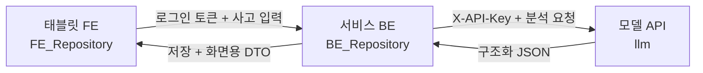

# FE·BE·모델 API 연동 및 병합 계약

## 1. 가장 쉬운 설명

세 저장소의 코드를 한 저장소에 물리적으로 합치는 구조가 아닙니다. 각 저장소에서 담당 기능을
PR로 병합하고, 배포된 서비스끼리 아래 순서로 통신합니다.



FE가 모델 API를 직접 부르면 안 됩니다. 모델 API 키가 브라우저에 노출되고 사고 기록·현장
확인 레코드의 권한 검증을 우회할 수 있기 때문입니다.

## 2. 저장소별 책임

| 저장소 | 담당 | 담당하지 않는 것 |
|---|---|---|
| `FE_Repository` | 태블릿 UI, 사용자 입력, 분석 상태 표시 | 모델 API Key, CAMEO 판정 |
| `BE_Repository` | 로그인, 사고 CRUD, 현장 확인 기록, AI 호출·저장 | 위험등급 임의 계산 |
| `llm` | 구조화·검색·규칙 검토·근거와 버전 반환 | 사용자 로그인, 사고 영구 저장 |

기계 판독 가능한 같은 내용은
[`contracts/model-api-integration-v1.json`](../contracts/model-api-integration-v1.json)에
고정합니다.

FE가 직접 소비할 BE/BFF 계약은 별도로 고정했습니다.

- OpenAPI: [`dashboard-bff-v1.openapi.json`](../contracts/dashboard-bff-v1.openapi.json)
- TypeScript 타입: [`dashboard-bff-v1.types.ts`](../contracts/dashboard-bff-v1.types.ts)
- fetch 예제: [`dashboard-bff-client.ts`](../examples/integration/dashboard-bff-client.ts)
- 실제 FE 코드 차이와 적용 순서: [`FE_BE_HANDOFF.md`](FE_BE_HANDOFF.md)

권장 FE용 경로는 다음 네 개입니다.

```text
POST /api/c2guard/v1/substances/discover
POST /api/c2guard/v1/incidents/analyze
POST /api/c2guard/v1/incidents/{incidentId}/confirmations
POST /api/c2guard/v1/incidents/{incidentId}/movement
POST /api/c2guard/v1/incidents/{incidentId}/record
```

이 경로의 구현 소유자는 `BE_Repository`입니다. `llm` FastAPI에 같은 경로를 추가하거나
CORS를 열지 않습니다. 브라우저는 같은 origin의 BFF를 우선 사용하고, 모델 API Key는 BE
배포 Secret에만 둡니다.

## 3. 실제 호출 순서

전국 지도·현재 위치·길찾기와 에이전트 상태의 상세 계약은
[전국 현장대응 에이전트와 지도 연동](OPERATIONS_AGENT_AND_MAP.md)을 먼저 확인합니다.

### 3.0 물질명을 모를 때

1. FE가 상태·색상·냄새·용도 관찰을 BE에 보냅니다.
2. BE가 `POST /api/v1/substances/discover`를 호출합니다.
3. AI가 확인 전 후보, 일치 성상과 출처 카드를 반환합니다.
4. FE는 후보를 복수로 표시하고 `현장 물질 확인`을 요청합니다.
5. BE가 확인 레코드와 `confirmation_id`를 만든 뒤에만 충돌 검토 입력으로 사용합니다.

### 3.1 현장 확인 전

1. FE가 신고문·위치·검토 중 대응을 BE에 보냅니다.
2. BE가 사고 레코드를 만들고 자체 `incident_id`를 발급합니다.
3. BE가 `POST /api/v1/incidents/analyze`를 호출합니다.
4. AI가 물질 후보, 시설 이력 후보, 근거와 `confirmation_gate`를 반환합니다.
5. BE가 원본 응답과 `analysis_id`, `request_id`, 모델·데이터 버전을 저장합니다.
6. FE는 후보와 “현장 확인 필요” 상태만 표시합니다.

이 단계에서는 `risk_level_ko`, 구체적 반응과 AI 대응 권고를 표시하지 않습니다.
시설 이력은 현재 재고가 아니라 **과거 공개 이력 기반 시설물질 후보**입니다. 사용자가 입력한
`planned_actions`도 AI가 검증한 대응 권고가 아닙니다.

### 3.2 물질 두 개를 현장에서 확인한 뒤

1. 대원이 용기 라벨·현장 MSDS 등으로 사고물질과 시설물질을 확인합니다.
2. BE가 인증 사용자와 확인 시각을 포함한 서로 다른 확인 레코드 두 개를 저장합니다.
3. BE가 두 `confirmed_*_substance` 객체를 포함해 통합 API를 다시 호출합니다.
4. AI는 CAMEO 공개 근거 정책으로 결정론적 충돌 검토를 실행합니다.
5. AI는 완료된 Rule과 공식 검색 근거만 `grounded_rag`에 짧게 정리합니다.
6. FE는 `risk_scale.is_probability=false`를 지키고 서수 등급을 백분율로 바꾸지 않습니다.

BE는 `grounded_rag.statements[].source_ids`와 `citations[].source_id`를 연결해 BFF의
`groundedRag`로 전달합니다. 화면은 문장과 공식 원문 링크만 보여주며 LLM 모델명·지연시간을
주요 UI에 표시할 필요가 없습니다. `grounded_rag`가 없어도 기존 v1 응답을 처리할 수 있게
선택 필드로 취급합니다.

전문가 사전 승인은 이 API 실행 조건이 아닙니다. 대신 공개 근거 파일럿 결과에는
`expert_reviewed=false`가 유지되며 최종 판단은 현장 지휘관에게 있습니다.

## 4. BE가 호출할 모델 API

사고 분석, 사고 에이전트 step, 물질탐색 API를 제공합니다. 단발 조회는 기존 통합 API를,
현장 확인까지 대화를 이어가는 화면은 agent step API를 기본 연동점으로 사용합니다.

```text
POST {CHEMICHECK119_MODEL_API_BASE_URL}/api/v1/incidents/analyze
X-API-Key: {CHEMICHECK119_MODEL_API_KEY}
X-Request-Id: {BE가 생성한 추적 ID}
Content-Type: application/json
```

상태를 이어가는 권장 경로:

```text
POST {CHEMICHECK119_MODEL_API_BASE_URL}/api/v1/agents/incidents/step
X-API-Key: {CHEMICHECK119_MODEL_API_KEY}
X-Request-Id: {BE가 생성한 추적 ID}
Content-Type: application/json
```

요청의 `analysis`에는 기존 `/incidents/analyze` body를 넣습니다. 첫 호출은 `memory` 없이
보내고, 이후에는 직전 응답의 `memory`를 BE 사고 레코드에 저장했다가 함께 보냅니다. 서버
인스턴스 내부에는 사고 세션을 저장하지 않습니다.

BE 환경변수 권장 계약:

```text
CHEMICHECK119_MODEL_API_BASE_URL=https://내부-모델-api
CHEMICHECK119_MODEL_API_KEY=64자리-hex-또는-43자리-base64url-secret
CHEMICHECK119_MODEL_API_SCHEMA=chemiguard119-api-v1
CHEMICHECK119_MODEL_API_CONNECT_TIMEOUT_SECONDS=2
CHEMICHECK119_MODEL_API_RESPONSE_TIMEOUT_SECONDS=15
```

API Key는 `.env` 예제에 실제 값을 쓰지 않고 배포 플랫폼의 Secret으로 주입합니다.

물질검색 탭은 별도 조회 API를 사용합니다.

```text
POST {CHEMICHECK119_MODEL_API_BASE_URL}/api/v1/substances/discover
```

## 5. BE 요청 예시

```json
{
  "request_id": "REQ-BE-20260728-0001",
  "incident_id": "INC-BE-20260728-0001",
  "input": {
    "type": "DISPATCH_TEXT",
    "text": "차아염소산나트륨 저장탱크에서 누출이 의심됩니다.",
    "occurred_at": "2026-07-28T17:30:00+09:00"
  },
  "location": {
    "address": "경기 화성시 팔탄면",
    "province": "경기도",
    "facility_name": "예시 사업장",
    "latitude": 37.2181,
    "longitude": 126.9417,
    "coordinate_source": "DISPATCH_SYSTEM",
    "resolved_at": "2026-07-28T17:30:00+09:00"
  },
  "operations_context": {
    "dispatch_station_name": "화성소방서",
    "journey_state": "EN_ROUTE",
    "responder_position": {
      "latitude": 37.2065,
      "longitude": 126.8311,
      "observed_at": "2026-07-28T17:32:00+09:00",
      "source": "MDT_DEVICE_GPS",
      "accuracy_m": 12
    }
  },
  "planned_actions": [
    {
      "raw_text": "누출구역 통제 검토"
    }
  ],
  "evidence_top_k": 5
}
```

정확한 전체 요청은
[`examples/api/incident_unconfirmed_request.json`](../examples/api/incident_unconfirmed_request.json),
확인 후 요청은
[`examples/api/incident_confirmed_request.json`](../examples/api/incident_confirmed_request.json)을
사용합니다.

확인 전 대시보드의 안전한 응답 fixture는
[`examples/api/incident_unconfirmed_response.json`](../examples/api/incident_unconfirmed_response.json)
입니다. FE·BE는 이 fixture를 mock과 계약 테스트에 사용할 수 있습니다.

## 6. BE 저장 최소 필드

모델 응답 전체를 감사용 JSON으로 보관하되 최소한 다음 필드를 별도 조회 가능하게 저장합니다.

| 필드 | 이유 |
|---|---|
| `incident_id` | 서비스 사고와 연결 |
| `analysis_id` | 분석 실행 식별 |
| `request_id` | 세 서비스 로그 연결 |
| `state` | 화면·재시도 상태 |
| `schema_version` | 계약 호환성 |
| `input_fingerprint` | 같은 입력인지 확인, 원문 대체용 아님 |
| `provenance` | 모델·데이터·정책 버전 |
| `confirmation_gate` | 충돌 검토 실행 조건 감사 |
| `agent` | 대응 단계·다음 행동·사고/현재 위치·경로 provenance |
| agent step `memory` | 사고별 revision·대기 입력·도구 실행 이력·parent hash |
| agent step `events` | PLAN·ACT·OBSERVE·REPLAN 도구 감사 로그 |
| `created_at` | BE 저장 시각 |

후보 점수는 확률 컬럼에 저장하지 않습니다. 시설 이력 후보도 현재 재고 테이블로 승격하지
않습니다.

대화 전체 저장은 모델 API가 아니라 BE의 책임입니다. `incident_id`, 순서가 있는 메시지,
분석 원본, `analysis_id` 목록, 확인 레코드, provenance, 저장 사용자·시각을 한 대응 기록으로
묶습니다.

에이전트 memory 저장은 낙관적 잠금으로 처리합니다. BE는 현재 저장된
`memory_sha256`이 새 응답의 `parent_memory_sha256`과 같은 경우에만 다음 revision으로
교체합니다. 다르면 동시에 진행된 더 최신 요청이 있다는 뜻이므로 자동 덮어쓰지 않습니다.
SHA-256은 손상 감지용이며 호출 인증은 반드시 `X-API-Key`로 유지합니다. memory의 확인 상태만
믿어 Rule을 실행해서도 안 됩니다. 모델 API는 매번 현재 요청의 두 확인 레코드를 다시 검사합니다.
모델·artifact·Rule 정책·RAG 설정이 바뀌면 `runtime_state_fingerprint`가 달라져 대기 중인
동일 신고도 자동으로 다시 분석됩니다.

## 7. FE에 내려줄 상태

BE는 HTTP 성공 여부와 모델 워크플로 상태를 분리합니다.

| AI 결과 | BE가 FE에 전달할 의미 |
|---|---|
| `AWAITING_SUBSTANCE_CONFIRMATION` | 사고·시설물질 후보 표시, 두 확인 입력 요청, 위험 카드 잠금 |
| `AWAITING_INCIDENT_CONFIRMATION` | 사고물질 확인 입력 요청, 위험 카드 잠금 |
| `AWAITING_FACILITY_CONFIRMATION` | 시설물질 확인 입력 요청, 위험 카드 잠금 |
| `SCREENING_COMPLETED` | 공개근거·서수 위험등급·우선 확인 표시 |
| `UNCLASSIFIED` | 근거 부족, 외부 MSDS 확인 안내 |
| `CAS_EVIDENCE_NOT_LOADED` | 다른 물질 근거로 대체하지 않고 상세 근거 미적재 표시 |
| HTTP `401` | 사용자 오류가 아니라 서버 인증 구성 장애 |
| HTTP `422` | FE 자유 문구가 아니라 BE→AI 계약 오류로 기록 |
| HTTP `503` | 준비 전·일시 장애. 응답의 `retryable` 확인 |

FE는 `schema_version`, `state`, `confirmation_gate`, `conflict_review`,
`required_next_steps`, `safety_notice`가 없는 성공 응답을 정상 결과로 표시하지 않습니다.

완료 결과의 `conflict_review.result.reference_assurance`도 손실 없이 camelCase
`conflictReview.result.referenceAssurance`로 전달합니다.

| assurance 상태 | FE 배지 | 동작 |
|---|---|---|
| `REFERENCE_TRIANGULATED` | 공식근거 교차확인 | 출처 수·기관 수·주장·한계를 접어서 표시 |
| `PRIMARY_AUTHORITY_ONLY` | CAMEO 단일체계 근거 | 단일 체계임을 경고하고 원문 링크 표시 |
| Rule `VERIFY_REQUIRED` | 근거 검증 필요 | 위험등급 숨김, 현장 MSDS 확인 요청 |

`REFERENCE_TRIANGULATED`를 “전문가 승인”으로 번역하면 안 됩니다. FE는
`claimChecks`의 `NOT_PROVEN`과 `NOT_PERFORMED`를 대응 근거 영역에서 확인 가능하게 합니다.

현재 대시보드 BFF v1은 실제 배포 정책인
`PUBLIC_SOURCE_PILOT_V1 / SCREENING_COMPLETED` 표시 계약만 고정합니다. 모델 API의 향후
전문가 승인 `APPROVED_ONLY / COMPLETED` 결과를 FE에 노출할 때는 BFF 계약 버전을 올리고
별도 검증 타입을 추가합니다.

완료 결과는 느슨한 `HIGH/MEDIUM/LOW` 허용목록만 검사하지 않습니다.
[`dashboard_public_pair_contract.json`](../config/dashboard_public_pair_contract.json)에
공개 검증 15개 물질쌍별 CAS–CAMEO ID·선택 형태·등급·hazard/gas·근거 URL·필수 확인·한계를
고정했습니다. BE는 모델 응답을 1:1 투영해야 하며 이 값을 다시 생성하거나 축약하지 않습니다.
계약에 없는 물질쌍이나 한 필드라도 다른 결과는 완료 카드가 아니라 계약 오류로 처리합니다.

### 7.1 대시보드 표시 규칙

현재 디자인의 “대응충돌검토 결과” 영역은 API 상태에 따라 완전히 다른 카드로 렌더링해야
합니다.

| 조건 | 제목 | 표시 | 숨김 |
|---|---|---|---|
| 확인 전 | 물질 후보 확인 필요 | 신고문 후보, 과거 이력 후보, 확인 버튼 | 위험등급, 반응, 대응 권고 |
| 한 물질만 확인 | 추가 물질 확인 필요 | 확인된 CAS, 남은 확인 역할 | 위험등급, 반응, 대응 권고 |
| 두 물질 확인 + 규칙 실행 | 대응충돌검토 결과 | 서수 등급, 반응, 근거 보증 상태·URL·버전 | 확률·백분율·전문가 승인 표현 |
| 두 물질 확인 + 근거 부족 | 공개 근거 부족 | 확인된 두 CAS, 추가 확인 안내 | 임의 위험등급 |

기계 판독 가능한 원본은
[`contracts/model-api-integration-v1.json`](../contracts/model-api-integration-v1.json)의
`presentation_policy`입니다.

물질검색 모드는 **물질명·별칭·CAS**와 **두 가지 이상 성상 관찰 기반 후보 검색**을
지원합니다. 성상 결과는 식별 확정이 아니며 `requires_responder_confirmation=true`인
후보입니다. 후보 카드의 `body_preview`는 “AI 판단 이유”가 아니라 “공식 문서 발췌”로
표시합니다.

### 7.2 v1의 물질쌍 제한

v1 통합 요청은 사고물질 1개와 시설물질 1개, 응답은 충돌 검토 1개만 지원합니다. 화면에
시설물질 후보가 두 개 이상 있어도 확인 전에는 후보 카드로만 표시합니다. 여러 확인 물질쌍을
한 번에 실행하는 `pair_reviews[]`는 API 하위 호환성 검토가 필요한 v2 후속 작업입니다.

## 8. Timeout과 재시도

- 연결 timeout: 2초
- 전체 응답 timeout: 15초
- 네트워크 연결 실패 또는 `retryable=true`인 `503`: 최대 1회만 짧은 jitter 후 재시도
- `401`, `422`, `500`: 자동 재시도하지 않음

현재 AI API는 분석 결과를 영구 저장하지 않는 stateless 서비스라 전송 전 연결 실패에 대한
재호출은 가능하지만, `X-Request-Id`는 idempotency key가 아닙니다. BE는 각 호출 결과를
저장할 때 `analysis_id` 중복 여부를 별도로 관리해야 합니다.

`기록저장` 버튼은 다음 순서를 지켜야 합니다.

```text
초기화 안내 → BE 저장 요청 → 저장 성공 → 토스트 → 화면 초기화
```

저장 실패나 timeout이면 대화 화면을 유지합니다.

## 9. 계약 검증

AI 배포 후 다음 명령으로 liveness, readiness, schema, 인증과 통합 분석을 확인합니다.

```bash
PYTHONPATH=src python scripts/integration/smoke_model_api.py \
  --base-url https://모델-api-주소 \
  --api-key-env CHEMICHECK119_MODEL_API_KEY
```

BE CI에서는 모델 서버를 직접 띄우지 않아도 다음을 fixture로 고정할 수 있습니다.

- 요청: `examples/api/incident_unconfirmed_request.json`
- API schema: `chemiguard119-api-v1`
- 계약 manifest: `contracts/model-api-integration-v1.json`
- 오류 계약: `docs/API.md`
- 물질 탐색 요청·응답:
  `examples/api/material_discovery_request.json`,
  `examples/api/material_discovery_response.json`

BE 구현 언어가 확인되면 해당 저장소 안에 실제 HTTP client와 mock server 계약 테스트를
작성합니다.

## 10. 저장소별 PR 병합 순서

1. `llm`: API 계약·테스트·Docker 검증을 통과한 PR을 `main`에 병합합니다.
2. `BE_Repository`: 병합된 AI schema를 기준으로 모델 client와 저장 로직 PR을 병합합니다.
3. `FE_Repository`: 확정된 BE 응답 DTO를 기준으로 화면 연동 PR을 병합합니다.
4. staging에서 FE→BE→AI 실제 호출과 `request_id` 로그 연결을 확인합니다.
5. 세 저장소의 배포 commit과 모델 artifact manifest를 릴리스 기록에 고정합니다.

세 저장소의 미완성 브랜치를 동시에 합치면 계약 변경 원인을 추적하기 어렵습니다. AI 계약을
먼저 병합하되, 호환성이 깨지는 변경은 `/api/v2` 또는 명시적인 schema 버전 변경으로
진행합니다.

## 11. 저장소 경계

이 문서의 실행 예제와 계약 테스트는 `chemicheck119/llm` 저장소 범위에서 검증합니다.
FE·BE 저장소의 실제 반영 여부는 각 담당자가 해당 저장소의 PR과 staging 통합 시험으로
확인해야 하며, 이 문서만으로 세 저장소 연동 완료를 주장하지 않습니다.
