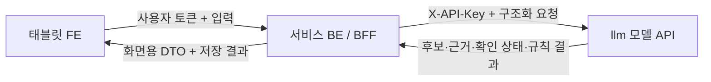

# FE·BE 연동 인수인계서

기준일: 2026-07-31
대상: `chemicheck119/FE_Repository`, `chemicheck119/BE_Repository`, `chemicheck119/llm`

> 이 문서는 `FE_Repository`의 `main` 브랜치 `src/app/App.tsx`를 읽기 전용으로
> 확인하고, `llm` 저장소의 실제 API 계약과 비교해 작성했다. 아래 줄 번호는 확인 시점의
> `App.tsx` 기준이며 이후 FE 수정으로 달라질 수 있다. 이번 작업에서는 **FE·BE 저장소를
> 수정하지 않았다.**

## 1. 팀원이 먼저 읽을 한 페이지 요약

현재 화면은 데모 모양은 갖췄지만, 실제 데이터 흐름은 아직 다음 세 부분이 끊겨 있다.

1. 물질검색은 모델 API가 아니라 FE 내부 mock을 보여준다.
2. 대응충돌검토는 예전 BE 응답 형식을 사용해 현장 확인 전에도 위험을 표시할 수 있다.
3. 하단 `기록저장`은 서버에 저장하지 않고 화면부터 초기화한다.

연동은 아래처럼 고정한다.



브라우저인 FE가 모델 API를 직접 호출하면 안 된다. 모델 API Key가 노출되고, 사용자 인증과
현장 확인 기록을 우회할 수 있기 때문이다. FE는 BE/BFF만 호출하고, BE만 모델 API를 호출한다.

사용 흐름은 네 동작으로 단순화한다.

1. **물질검색**: 이름·CAS 또는 두 가지 이상 성상 관찰로 복수 후보를 찾는다.
2. **사고분석**: 신고문과 출동지령 정보를 보내 후보와 다음 확인 항목을 받는다.
3. **현장 물질 확인**: 용기 라벨·현장 MSDS 등으로 사고물질과 시설물질 CAS를 각각 기록한다.
4. **기록저장**: 대화·분석·확인 기록을 서버에 저장한 다음 화면을 초기화한다.

화면에서 반드시 지킬 규칙은 다음과 같다.

- 사고물질과 시설물질이 모두 확인되기 전에는 위험등급·구체적 반응·대응 권고를 숨긴다.
- `LOW`는 “안전”이 아니다. **현재 공개 규칙에서 확인된 위험이 낮다는 서수 등급**일 뿐이다.
- 근거 없음, 미지원 조합, 규칙 미실행을 `LOW`로 바꾸지 않는다.
- 업체 데이터는 `보유 확인`이 아니라
  **과거 공개 이력 기반 시설물질 후보 · 현장 확인 필요**로 표시한다.
- 후보 검색 점수는 확률이나 신뢰도 퍼센트가 아니다.
- `현장 물질 확인`과 `기록저장`은 서로 다른 기능이다.

## 2. 현재 FE 코드에서 확인된 연동 문제

확인 대상:
[`src/app/App.tsx`](https://github.com/chemicheck119/FE_Repository/blob/main/src/app/App.tsx)

| 실제 줄 | 현재 동작 | 문제 | 바꿀 방향 |
|---|---|---|---|
| 405 | `API_BASE`가 `http://localhost:8080`으로 고정 | 배포 환경에서 사용자 기기의 localhost를 호출함 | `VITE_CHEMICHECK119_BFF_BASE_URL`로 BE 주소만 주입 |
| 398, 810 | 물질검색 응답을 FE 내부 `MOCK_RESPONSES`와 `setTimeout`으로 생성 | 모델이 찾은 실제 후보·출처가 아님 | BFF `POST /api/c2guard/v1/substances/discover` 호출 |
| 777 | `POST /api/incident-check`에 `facilityName`, `incidentSubstance`를 보내고 legacy DTO를 기대 | 최신 모델의 확인 게이트·근거·버전 정보가 사라짐 | FE가 BFF v1 `/api/c2guard/v1/incidents/analyze`로 교체 |
| 467 | `facilityFound`를 기준으로 “N종 보유 확인” 표시 | 과거 ICIS·PRTR 이력을 현재 재고처럼 오해시킴 | “과거 공개 이력 후보 N종 · 현장 확인 필요” 표시 |
| 421 | 카드의 `확인`이 `POST /api/c2guard/records` 저장을 수행 | 물질 확인과 전체 기록 저장이 섞임 | 별도 `현장 물질 확인` API로 confirmation 생성 |
| 833 | 하단 `기록저장`이 서버 저장 없이 메시지와 결과를 초기화 | 저장 실패를 알 수 없고 대응 기록이 유실됨 | 저장 성공 후에만 토스트와 초기화 수행 |

추가로 현재 `IncidentCheckResult`의 `hasIncompatible: boolean` 하나만으로는 다음 네 상태를
구별할 수 없다.

- 두 CAS가 확인되지 않아 규칙을 실행하지 않음
- 공개 규칙이 없는 조합
- 규칙을 실행했고 위험 반응을 찾지 못함
- 규칙을 실행했고 위험 반응을 찾음

따라서 `hasIncompatible=false`를 `낮음` 또는 `안전`으로 렌더링하면 안 된다. FE는
`state`, `confirmationGate`, `conflictReview.executed`, `conflictReview.status`를 함께
사용해야 한다.

## 3. 권장 FE용 BFF 경로 4개

아래는 **FE가 호출할 BE/BFF v1 경로**다. 모델 API `/api/v1/*`와 구분하며,
[`dashboard-bff-v1.openapi.json`](../contracts/dashboard-bff-v1.openapi.json)을 단일 원본으로
사용한다. 현재 FE의 `/api/incident-check`는 상태를 충분히 표현하지 못하는 legacy 계약이라
신규 v1 경로로 교체한다.

| 목적 | FE → BE/BFF | BE → llm 또는 저장소 | 성공 기준 |
|---|---|---|---|
| 사고분석 | `POST /api/c2guard/v1/incidents/analyze` | `POST /api/v1/incidents/analyze` | 최신 `state`·gate·근거·버전을 포함한 화면 DTO |
| 물질검색 | `POST /api/c2guard/v1/substances/discover` | `POST /api/v1/substances/discover` | 후보·일치 성상·공식 출처와 확인 필요 상태 |
| 현장 확인 | `POST /api/c2guard/v1/incidents/{incidentId}/confirmations` | BE 확인 레코드 저장 | `confirmationId`, `reanalyzeRequired=true`; 이어서 사고분석 API 재호출 |
| 대응 기록 저장 | `POST /api/c2guard/v1/incidents/{incidentId}/record` | BE 영구 저장소 | `recordId`와 `resetAllowed=true`; 성공 전 FE 초기화 금지 |

현재 BFF v1의 위험 표시 완료 상태는 배포 정책과 같은
`PUBLIC_SOURCE_PILOT_V1 / SCREENING_COMPLETED`만 지원한다. 향후 전문가 승인
`APPROVED_ONLY / COMPLETED`를 화면에 추가하려면 기존 타입을 느슨하게 바꾸지 말고 계약 버전을
올려 별도 fixture와 검증을 추가한다.

또한 완료 결과는
[`config/dashboard_public_pair_contract.json`](../config/dashboard_public_pair_contract.json)의
공개 검증 15개 물질쌍에 한정한다. “형식상 유효한” 다른 CAMEO ID·물리적 형태·hazard/gas
코드로 바꿔 끼운 응답도 거부한다. 이 파일은 원천 pair snapshot과 crosswalk에서 결정적으로
생성되며 `scripts/contracts/export_contracts.py --check`가 drift를 차단한다.

### 3.1 물질검색

FE 요청 예시:

```json
{
  "query": "무색 투명하고 박하 냄새가 나는 휘발성 액체",
  "topK": 5
}
```

화면은 후보를 확정값처럼 사용하지 않고 다음을 표시한다.

- 물질명과 CAS
- 입력과 일치한 상태·색상·냄새·용도
- `소방청 울산 화학물질 정보 기반 관찰 후보`
- 상세 근거가 있으면 `공식 문서 발췌`와 원문 URL
- `현장 확인 필요`

`NO_RELIABLE_CANDIDATE`는 “물질 없음”이나 “위험 없음”이 아니다. 관찰 정보를 보강하거나
외부 공식 MSDS를 확인해야 하는 상태다.

### 3.2 사고분석

FE는 신고 내용과 BE가 보유한 출동지령 정보를 함께 보낸다. 시설명·주소·좌표를 신고문 파서가
임의로 생성하게 하지 않는다.

```json
{
  "incidentId": "INC-20260731-0001",
  "text": "차아염소산나트륨 탱크에서 누출 중이며 옆 저장고에 염산이 있습니다.",
  "inputType": "DISPATCH_TEXT",
  "occurredAt": "2026-07-31T20:30:00+09:00",
  "location": {
    "facilityName": "예시 사업장",
    "address": "울산광역시 예시 주소",
    "latitude": 35.512,
    "longitude": 129.198
  }
}
```

BE는 이를 모델의 `incident_id`, `input`, `location` 구조로 변환한다. 확인 전 모델 응답은
후보와 다음 확인 항목만 화면에 제공한다.

### 3.3 현장 물질 확인

권장 버튼명은 `확인`이 아니라 `현장 물질 확인`이다.

```json
{
  "role": "INCIDENT",
  "casNumber": "7681-52-9",
  "displayName": "차아염소산나트륨",
  "confirmationBasis": "CONTAINER_LABEL",
  "observedAt": "2026-07-31T20:35:00+09:00"
}
```

BE가 인증된 사용자, 확인 시각, 역할과 CAS를 저장하고 `confirmationId`와
`reanalyzeRequired=true`를 반환한다. 사진이나 문서가 진짜인지 모델이 임의로 보증하는
기능은 아니다. FE는 확인 성공 직후 사고분석 BFF를 다시 호출한다. BE는 저장된 확인 레코드를
읽어 모델의 확인 객체로 변환하므로, 두 역할이 모두 확인된 시점의 재분석에서만 충돌 규칙이
실행된다. 복사 가능한 구현 예시는
[`confirmAndRefreshIncident`](../examples/integration/dashboard-bff-client.ts)에 있다.

### 3.4 기록저장

`기록저장`은 지휘관 승인이나 위험 판정 승인이 아니라 **감사 가능한 대응 기록 저장**이다.

```text
기록저장 클릭
→ “저장 후 현재 화면이 초기화됩니다” 확인
→ 전체 대화·분석·현장 확인 기록을 BE에 전송
→ 201 + recordId 수신
→ 저장 완료 토스트
→ 화면 초기화
```

저장 실패, timeout, 네트워크 단절이면 화면과 대화를 그대로 유지한다.

## 4. 필드 매핑표

### 4.1 사고분석 요청

| 현재 FE 값 | 권장 BFF 필드 | llm 요청 필드 | 설명 |
|---|---|---|---|
| 새로 생성 | `incidentId` | `incident_id` | BE 사고 레코드의 안정적인 ID |
| 사용자 메시지 `trimmed` | `text` | `input.text` | 신고·현장 입력 원문 |
| 입력 종류 | `inputType` | `input.type` | `DISPATCH_TEXT`, `VOICE_TRANSCRIPT`, `STRUCTURED_FORM` 중 하나 |
| 사고 시각 | `occurredAt` | `input.occurred_at` | ISO 8601, 타임존 포함 |
| `facilityNameInput` | `location.facilityName` | `location.facility_name` | 파서 추정값이 아니라 출동지령 또는 사용자 선택 |
| 지도·출동지령 | `location.address` | `location.address` | 고정 mock이 아닌 BE 사고 정보 |
| 지도·출동지령 | `location.latitude/longitude` | `location.latitude/longitude` | 없으면 생략 가능 |
| 대응 대화 중 검토 문구 | `plannedActions[]` | `planned_actions[].raw_text` | AI가 이미 승인한 대응책으로 표시 금지 |

### 4.2 분석 응답과 화면

| llm 원본 | 권장 BFF/FE 필드 | 화면 동작 |
|---|---|---|
| `analysis_id` | `analysisId` | 기록 저장과 추적에 보관 |
| `request_id` | `requestId` | FE·BE·AI 장애 로그 연결 |
| `state` | `state` | 화면의 최상위 상태 분기 |
| `model_outputs.parser` | `parser` | 추출된 사고유형·물질 표현 표시 |
| `model_outputs.substance_candidates` | `substanceCandidates` | 복수 후보와 현장 확인 버튼 표시 |
| `model_outputs.facility_history_candidates.results` | `facilityHistory.candidates` | 과거 공개 이력 후보로 표시 |
| `confirmation_gate` | `confirmationGate` | 두 역할 확인 여부와 위험 카드 잠금 판단 |
| `conflict_review.executed` | `conflictReview.executed` | `true`일 때만 위험 결과 검토 |
| `conflict_review.status` | `conflictReview.status` | 미실행·근거 부족·완료를 구분 |
| 규칙 결과의 서수 위험등급 | `conflictReview.result.riskLevel` | 확률로 변환하지 않고 원래 등급 표시 |
| `rule_id`, `rule_version`, `scope`, `policy_mode` | `conflictReview.result`의 camelCase 필드 | 어떤 규칙·정책 결과인지 보존 |
| `mapping_provenance`, `evidence_provenance` | `conflictReview.result`의 camelCase 필드 | CAS–CAMEO 연결과 공개 근거 검증 추적 |
| `evidence[]` | `evidenceCards[]` | 제목·기관·발췌·원문 URL·문서 버전 표시 |
| `required_next_steps[]` | `requiredNextSteps[]` | 현장 확인 및 후속 행동 안내 |
| `provenance` | `provenance` | 모델·데이터·규칙·전문가 검토 여부 표시/저장 |
| `safety_notice` | `safetyNotice` | 결과 카드 하단에 누락 없이 표시 |

기존 `heldSubstanceCount`, `facilityFound`, `hasIncompatible`는 최신 안전 상태를 표현하기에
불충분하므로, 최신 필드로 교체하거나 **표시 편의용 파생값으로만** 사용한다. 특히
`hasIncompatible=false`에서 위험등급을 만들지 않는다.

완료 결과의 CAS·위험등급·hazard/gas·설명·근거 URL·규칙 버전·provenance는 BE가 새로
작성하거나 요약하지 않고 모델 원본에서 1:1로 투영한다. Python 기준 구현은
`project_completed_model_result()`이며, 원본 fixture와 BFF fixture의 안전 필드가 완전히
같은지 계약 테스트가 검사한다. pair별 정확한 값은
`config/dashboard_public_pair_contract.json`을 기준으로 검증한다.

### 4.3 물질검색 응답

| llm 원본 | 권장 FE 필드 | 화면 라벨 |
|---|---|---|
| `status` | `status` | 후보 검색 상태 |
| `candidates[].display_name` | `candidates[].displayName` | 물질 후보 |
| `candidates[].cas_number` | `candidates[].casNumber` | CAS |
| `candidates[].matched_properties` | `candidates[].matchedProperties` | 일치한 관찰 |
| `candidates[].property_profile` | `candidates[].propertyProfile` | 상태·색상·냄새·용도 |
| `candidates[].evidence[].body_preview` | `evidenceCards[].bodyPreview` | 공식 문서 발췌 |
| `source_url` | `sourceUrl` | 원문 보기 |
| `evidence_status` | `evidenceStatus` | 상세 근거 적재 여부 |
| `evidence_warning`, `evidence_notice`, `cas_link_warning` | 같은 의미의 camelCase 필드 | 경고를 후보 카드에서 숨기지 않음 |
| `requires_responder_confirmation` | `requiresResponderConfirmation` | 현장 확인 필요 |
| `candidate_score_is_probability=false` | 표시 정책 | 신뢰도 `%` 표시 금지 |

### 4.4 대응 기록 저장

| 저장 필드 | 내용 |
|---|---|
| `incidentId` | 하나의 대응 세션을 식별 |
| `messages[]` | 순번·역할·내용·시각이 있는 전체 대화 |
| `analysisIds[]` | FE가 세션 중 받은 모든 분석 ID, 1개 이상·중복 금지 |
| 서버가 ID로 결합 | BE가 저장한 모델 원본 snapshot과 provenance |
| `confirmationIds[]` | FE가 세션 중 받은 확인 ID, 중복 금지·미확인 사고는 빈 배열 가능 |
| 서버가 ID로 결합 | BE가 저장한 역할·CAS·근거·인증 사용자·확인 시각 |
| `savedBy`, `savedAt` | BE 인증 사용자와 서버 시각 |

분석 snapshot·확인 상세·provenance는 FE가 다시 보내는 값을 신뢰하지 않습니다. BE가
`analysisIds`와 `confirmationIds`로 이미 저장한 권위 레코드를 읽어 하나의 대응 기록으로
묶습니다. 메시지의 `analysisId`는 반드시 `analysisIds` 목록에 포함되어야 합니다.

## 5. 화면 상태 규칙

| 조건 | 표시 | 숨김 |
|---|---|---|
| `AWAITING_SUBSTANCE_CONFIRMATION` | 사고·시설 후보, 과거 이력, 두 현장 확인 입력 | 위험등급, 구체적 반응, 대응 권고 |
| 사고물질만 확인 | 확인된 사고 CAS, 시설물질 확인 요청 | 위험등급, 구체적 반응, 대응 권고 |
| 시설물질만 확인 | 확인된 시설 CAS, 사고물질 확인 요청 | 위험등급, 구체적 반응, 대응 권고 |
| 두 CAS 확인 + `executed=true` | 서수 위험등급, 구체적 반응, 공식 근거, 우선 확인 | 퍼센트·확률 |
| 두 CAS 확인 + 근거 부족 | “공개 근거 부족”, 확인된 CAS, 외부 MSDS 확인 | 임의의 `LOW`, “안전” |
| 모델 API 일시 장애 | 기존 대화 유지, 재시도 안내, request ID | 성공 결과처럼 보이는 mock |

`LOW`가 반환돼도 화면 문구는 `안전`이 아니라 예를 들어
`공개 규칙 기준 위험등급: 낮음`으로 표시한다. `LOW`에는
`isProbability=false`, 근거 URL, 규칙 버전, `expertReviewed`와 최종 판단 주체를 함께
제공한다.

## 6. 인증·환경변수·CORS 경계

### FE

- 공개 가능한 `VITE_CHEMICHECK119_BFF_BASE_URL`에는 **BE/BFF 주소만** 넣는다.
- `VITE_*` 값은 브라우저 번들에 포함되므로 모델 API Key나 영구 비밀정보를 넣지 않는다.
- 사용자 세션 토큰은 기존 BE 인증 정책에 따라 전송한다.
- FE가 `X-API-Key`를 생성하거나 보관하지 않는다.

예:

```text
VITE_CHEMICHECK119_BFF_BASE_URL=/api/c2guard/v1
```

### BE/BFF

- FE 사용자 인증과 사고 접근권한을 확인한다.
- 배포 Secret으로만 `CHEMICHECK119_MODEL_API_KEY`를 보유한다.
- 모든 모델 호출에 `X-Request-Id`를 전달하고 응답의 ID를 저장한다.
- 모델 응답을 화면 DTO로 변환하되 경고·출처·확인 상태를 삭제하지 않는다.
- 대화·확인·분석 원본을 BE가 영구 저장한다.

### 모델 API

- 브라우저 공개 호출을 허용하지 않는다.
- `X-API-Key`가 없거나 잘못되면 fail-closed한다.
- CORS로 인증을 대신하지 않는다.
- 가능하면 사설 네트워크 또는 BE 배포 egress만 접근하도록 제한한다.

### CORS

- **BE CORS**: 실제 FE 배포 origin만 허용한다. 개발 origin은 개발 환경에서만 추가한다.
- **모델 API CORS**: 브라우저 호출이 필요하지 않으므로 광범위한 `*` 허용을 두지 않는다.
- CORS는 브라우저 정책일 뿐 인증·인가가 아니다.

## 7. 오류 처리 계약

| 상황 | FE 동작 |
|---|---|
| BE `401/403` | 로그인·권한 오류로 처리 |
| 저장 참조 ID `409` | 다른 사고 또는 존재하지 않는 분석·확인 ID. 화면 유지 후 서버 로그 확인 |
| 모델 인증 오류를 BE가 수신 | 사용자 입력 오류로 돌리지 말고 서버 구성 장애로 표시 |
| 계약 검증 `422` | 사용자가 문구를 반복 입력하게 하지 말고 BE→AI 계약 오류로 기록 |
| retryable `503` | 기존 화면 유지, 한정 재시도 또는 재시도 버튼 |
| 저장 실패 | 대화와 분석을 유지하고 `기록저장` 재시도 |
| 근거 없음 | “공개 근거 부족”; `LOW`나 “안전”으로 대체 금지 |

mock fallback으로 실제 분석처럼 보이는 위험 결과를 만들어서는 안 된다. 데모 모드가 꼭
필요하면 화면에 `데모 데이터`를 명확하게 고정 표시하고 운영 빌드에서는 비활성화한다.

## 8. FE 구현 체크리스트

- [ ] `API_BASE` 하드코딩을 제거하고 `VITE_CHEMICHECK119_BFF_BASE_URL` 사용
- [ ] 물질검색의 `MOCK_RESPONSES`·`setTimeout` 경로를 BFF 호출로 교체
- [ ] 응답 타입을 `state`·`confirmationGate`·`conflictReview` 중심으로 변경
- [ ] 확인 전 위험등급·반응·대응 권고 숨김
- [ ] `hasIncompatible=false`를 `LOW` 또는 “안전”으로 변환하지 않음
- [ ] “N종 보유 확인”을 “과거 공개 이력 후보 N종 · 현장 확인 필요”로 변경
- [ ] 카드 버튼명을 `현장 물질 확인`으로 바꾸고 confirmation API 연결
- [ ] 확인 성공 뒤 `reanalyzeRequired=true`이면 같은 사고 ID로 사고분석 API 재호출
- [ ] `groundedRag.statements`를 짧은 대응 근거로, 연결된 `citations.sourceUrls`를 원문 링크로 렌더링
- [ ] RAG 미실행·fallback 상태를 오류로 과장하지 말고 `conflictReview`를 위험등급 원본으로 사용
- [ ] 근거 경고와 `safetyNotice`를 누락 없이 표시
- [ ] `기록저장` 전 초기화 안내 확인창 표시
- [ ] 저장 성공 후에만 토스트와 화면 초기화
- [ ] 저장 실패·분석 장애 시 대화 유지
- [ ] 지도·시설명·주소의 고정값을 BE 출동지령 데이터로 교체
- [ ] loading·empty·error·awaiting-confirmation·completed 상태를 각각 테스트

## 9. BE 구현 체크리스트

- [ ] FE용 BFF v1 4개 경로를 `dashboard-bff-v1.openapi.json`대로 구현
- [ ] `/api/c2guard/v1/incidents/analyze`를 최신 모델 `/api/v1/incidents/analyze`에 매핑
- [ ] `/api/c2guard/v1/substances/discover` Controller와 모델 client 구현
- [ ] confirmation 레코드에 사고 ID·역할·CAS·근거·사용자·서버 시각 저장
- [ ] 두 역할 확인 전 모델의 규칙 실행 입력을 만들지 않음
- [ ] 사고분석 요청마다 저장된 confirmation을 조회하고, 두 역할 확인 후 모델 확인 객체로 변환
- [ ] 후보·이력과 확인된 현재 물질을 서로 다른 컬럼/DTO로 관리
- [ ] 원본 `state`·gate·경고·출처·provenance를 보존
- [ ] `hasIncompatible=false`만으로 `LOW`를 생성하지 않음
- [ ] FE의 분석·확인 ID로 BE의 권위 snapshot·확인·버전을 조회해 한 기록으로 저장
- [ ] 저장을 transaction 또는 동등한 원자성으로 처리
- [ ] 모델 API Key를 Secret으로 주입하고 FE 응답에 노출하지 않음
- [ ] timeout, retryable `503`, 구조화 오류, request ID 로그 연결 구현
- [ ] 모델 fixture 기반 계약 테스트와 staging smoke test 추가

## 10. 통합 완료 판정 체크리스트

다음 시나리오가 staging에서 모두 성공해야 “연동 완료”라고 말할 수 있다.

1. 물질 성상 두 가지 이상 입력 → 실제 후보·출처 표시 → 위험 카드는 잠김
2. 신고문 입력 → 후보와 과거 이력 표시 → `보유 확인` 문구 없음
3. 사고물질만 확인 → 여전히 위험 카드 잠김
4. 시설물질까지 확인 → 규칙이 있을 때만 위험·근거 표시
5. 미지원 조합 → `공개 근거 부족`, `LOW/안전` 미표시
6. 기록저장 성공 → `recordId` 수신 → 토스트 → 초기화
7. 기록저장 실패 → 전체 대화 유지
8. 모델 API 장애 → 기존 화면 유지, mock 위험 결과 미표시
9. 브라우저 네트워크 탭 → 모델 API Key와 모델 API 직접 호출 없음
10. 같은 `requestId`로 FE·BE·AI 로그 추적 가능

계약 fixture:

- [`material_discovery_request.json`](../examples/bff/material_discovery_request.json)
- [`material_discovery_candidates_response.json`](../examples/bff/material_discovery_candidates_response.json)
- [`material_discovery_no_match_response.json`](../examples/bff/material_discovery_no_match_response.json)
- [`incident_analyze_request.json`](../examples/bff/incident_analyze_request.json)
- [`incident_awaiting_confirmation_response.json`](../examples/bff/incident_awaiting_confirmation_response.json)
- [`incident_screening_completed_response.json`](../examples/bff/incident_screening_completed_response.json)
- [`confirmation_request.json`](../examples/bff/confirmation_request.json)
- [`confirmation_response.json`](../examples/bff/confirmation_response.json)
- [`record_save_request.json`](../examples/bff/record_save_request.json)
- [`record_save_success_response.json`](../examples/bff/record_save_success_response.json)
- [`record_save_failure_response.json`](../examples/bff/record_save_failure_response.json)
- [`model_unavailable_error_response.json`](../examples/bff/model_unavailable_error_response.json)

모델 원본 fixture:

- [`conflict_screening_completed_result.json`](../examples/api/conflict_screening_completed_result.json)
- [`incident_unconfirmed_request.json`](../examples/api/incident_unconfirmed_request.json)
- [`incident_unconfirmed_response.json`](../examples/api/incident_unconfirmed_response.json)
- [`incident_confirmed_request.json`](../examples/api/incident_confirmed_request.json)
- [`material_discovery_request.json`](../examples/api/material_discovery_request.json)
- [`material_discovery_response.json`](../examples/api/material_discovery_response.json)

기계 판독 계약:

- [`dashboard-bff-v1.openapi.json`](../contracts/dashboard-bff-v1.openapi.json)
- [`dashboard-bff-v1.types.ts`](../contracts/dashboard-bff-v1.types.ts)
- [`model-api-integration-v1.json`](../contracts/model-api-integration-v1.json)

## 11. 서비스명 결정 필요

회의 메모의 서비스명은 `케미가드`, 현재 FE 화면·저장소 문서·모델 API의 공개 이름은
`케미체크119`, API schema 문자열은 기존 호환성 때문에 `chemiguard119-api-v1`이다.

팀이 최종 이름을 먼저 하나로 결정해야 한다. 결정 후 다음을 한 번에 변경한다.

- FE 로고와 화면 문구
- BE 응답·기록 메타데이터
- 모델 API의 사용자 표시용 `service_name`
- README·발표 자료·배포 이름

`schema_version`은 표시용 서비스명과 다른 기술 계약 식별자다. 이름을 정했다고 즉시 바꾸면
기존 클라이언트 호환성이 깨질 수 있으므로, schema 변경은 별도 버전 정책으로 처리한다.

## 12. 이번 문서의 범위

이번 작업은 `chemicheck119/llm` 저장소에 연동 계약을 기록한 것이다.
`FE_Repository`와 `BE_Repository`에는 어떤 코드 변경도 하지 않았다. 따라서 이 문서 작성만으로
실제 연동·배포가 완료된 것은 아니다.

권장 적용 순서는 다음과 같다.

1. `llm`의 모델 API 계약과 fixture를 기준 버전으로 고정
2. BE가 모델 client, BFF 4개 경로, 저장과 confirmation을 구현
3. FE가 확정된 BFF DTO로 mock·legacy 흐름을 교체
4. staging에서 FE → BE → llm 통합 시나리오 검증
5. 세 서비스의 배포 commit과 모델·데이터·규칙 버전을 릴리스 기록에 고정
