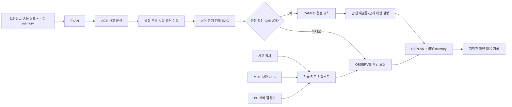

# 전국 현장대응 에이전트와 지도 연동

## 1. 한 문장 설명

케미체크119의 에이전트는 대화만 생성하는 챗봇이 아니라, **현재 사고 상태를 관찰해 필요한
도구를 고르고, 결과를 본 뒤 다시 계획하며, 막힌 입력을 구조화해서 반환하는 안전 상태
머신**입니다.



LLM은 위험도를 결정하지 않습니다. 물질 두 개가 현장에서 확인되기 전에는 CAMEO 규칙과
대응 설명도 실행하지 않습니다.

## 2. 왜 기존 화면보다 설득력이 생기는가

기존 지도 iframe과 고정 마커는 “사고 장소를 보여주는 목업”에 가까웠습니다. 새 계약은
화면이 다음 사실을 구분해서 보여줄 수 있게 합니다.

| 화면 정보 | 실제 출처 | 없을 때 동작 |
|---|---|---|
| 사고 위치 | 디스패치 좌표, 서버 지오코딩, 대원 관찰 | `INCIDENT_LOCATION_REQUIRED` |
| 소방대 현재 위치 | 차량 GPS 또는 MDT 단말 GPS | `RESPONDER_POSITION_REQUIRED` |
| 도로 경로·ETA | BE가 서버 측 길찾기 API로 조회 | `ROUTE_UNAVAILABLE`; 직선 경로 생성 금지 |
| 이동 진행률 | 길찾기 전체 거리와 남은 거리 | 위험 확률과 구분해 `progressRatioIsProbability=false` |
| 에이전트 단계 | 실제 파서·검색·게이트·규칙 실행 상태 | 막힌 단계와 다음 행동 반환 |
| 확산·위험 반경 | 현재 검증 모델 없음 | `NOT_COMPUTED_NO_VALIDATED_DISPERSION_MODEL` |

현재 위치가 5분 넘게 갱신되지 않으면 `POSITION_STALE`로 바뀌고 ETA를 숨깁니다. 발표용
이동 경로는 반드시 `DEMO_SIMULATION`으로 표시하므로 실제 길찾기처럼 속이지 않습니다.
경로의 시작·끝이 현재 위치와 사고 위치에서 각각 1.5km 넘게 벗어나면
`ROUTE_ENDPOINT_MISMATCH`로 차단합니다.

## 3. 전국 범위의 정확한 의미

2026-08-01 배포 후보 SQLite에서 직접 계산한 시설 과거 이력 범위는 다음과 같습니다.

```text
시·도: 17개
서로 다른 시설: 28,647개
시설-물질 후보 행: 168,424개
서로 다른 CAS: 133개
시·도 미상 시설: 3개
```

따라서 시설 **과거 이력 후보 검색**은 울산 전용이 아닙니다. 다만 이 수치는 현재 재고나
전국의 모든 화학시설을 의미하지 않습니다. API는 항상 다음 의미를 함께 반환합니다.

```text
evidence_class = REPORTED_HANDLING_HISTORY
current_inventory_confirmed = false
scope = NATIONWIDE_KOREA_HISTORICAL_CANDIDATES
```

색·냄새·물리 상태로 물질을 찾는 성상 프로필은 소방청 울산 화학물질 정보가 원천인 보조
기능입니다. 이를 전국 성상 데이터라고 주장하지 않으며 readiness의
`data_scope_semantics.property_profile`에서 별도로 공개합니다.

로컬 artifact 범위는 다음 명령으로 다시 확인할 수 있습니다.

```bash
chemiguard119 coverage
chemiguard119 coverage --json
```

## 4. 모델 API 사용

단발 분석은 기존 `/api/v1/incidents/analyze`로 계속 동작합니다. 같은 사고를 현장 확인까지
이어가는 실제 에이전트는 `/api/v1/agents/incidents/step`을 사용합니다. 요청의 `analysis`에는
기존 사고 분석 입력을 넣고, 두 번째 호출부터는 직전 응답의 `memory`도 함께 보냅니다.

```json
{
  "analysis": {
    "incident_id": "INC-20260801-0001",
    "input": {
    "type": "DISPATCH_TEXT",
    "text": "화성 공장에서 차아염소산나트륨 저장탱크 누출 신고"
    },
    "location": {
    "address": "경기 화성시 팔탄면",
    "latitude": 37.2181,
    "longitude": 126.9417,
    "coordinate_source": "DISPATCH_SYSTEM",
    "resolved_at": "2026-08-01T12:20:00+09:00"
    },
    "operations_context": {
    "dispatch_station_name": "화성소방서",
    "journey_state": "EN_ROUTE",
    "responder_position": {
      "latitude": 37.2065,
      "longitude": 126.8311,
      "observed_at": "2026-08-01T12:22:00+09:00",
      "source": "MDT_DEVICE_GPS",
      "accuracy_m": 12
    }
    }
  },
  "max_actions": 6
}
```

에이전트 응답은 실행 상태와 다음 입력, 다음 호출에 돌려줄 memory, 기존 분석 결과를 함께
제공합니다.

```json
{
  "status": "WAITING_FOR_HUMAN",
  "selected_tool_count": 3,
  "pending_inputs": [
    "FACILITY_SUBSTANCE_CONFIRMATION",
    "INCIDENT_SUBSTANCE_CONFIRMATION"
  ],
  "events": [
    {"phase": "PLAN", "tool_id": "RUN_INCIDENT_ANALYSIS"},
    {"phase": "REPLAN", "tool_id": "REQUEST_INCIDENT_CONFIRMATION"}
  ],
  "memory": {"revision": 1, "memory_can_trigger_rule": false},
  "analysis": {"state": "AWAITING_SUBSTANCE_CONFIRMATION"},
  "trace_is_chain_of_thought": false
}
```

`events`는 숨겨진 생각을 공개한 것이 아니라 도구 ID·결정 코드·성공/대기 상태만 기록한
감사 로그입니다. `memory`의 SHA-256은 전송 중 손상 탐지용이지 인증 서명이 아닙니다. API
Key로 호출자를 인증하고, BE는 `incident_id + revision + parent_memory_sha256`를 비교해 최신
memory만 저장해야 합니다. memory는 Rule 실행 권한으로 사용되지 않습니다.

전체 모델 API 계약은 `contracts/generated/model-api-v1.openapi.json`, 대시보드용 계약은
`contracts/dashboard-bff-v1.openapi.json`을 사용합니다.

## 5. 실제 이동 갱신 구조

GPS가 바뀔 때마다 무거운 AI 분석을 다시 실행하지 않습니다.

1. 최초 또는 신고 변경 시 BE가 모델 API `/api/v1/incidents/analyze`를 호출합니다.
2. 이동 중 FE가 5초 정도의 서버 지시 주기로 BFF movement API에 최신 GPS를 보냅니다.
3. BE는 위치 시각·순서를 검증하고 필요할 때만 길찾기 API를 재호출합니다.
4. FE는 받은 GeoJSON LineString과 현재 마커만 갱신합니다.
5. 도착하면 BE가 `ARRIVED` 또는 `ON_SCENE`을 반환합니다.

대시보드 BFF 계약:

```text
POST /api/c2guard/v1/incidents/{incidentId}/movement
```

요청·응답 fixture:

- `examples/bff/movement_update_request.json`
- `examples/bff/movement_update_response.json`
- `examples/bff/operations_agent_en_route.json`

BE는 `clientSequence`가 역행하는 GPS 갱신을 거부해야 합니다. 길찾기 API의 요금과 rate
limit를 보호하기 위해 매 GPS 이벤트마다 재탐색하지 말고 이동 거리·시간 임계값을 둡니다.

## 6. 지도 기술 결정

### 화면 렌더러

[MapLibre GL JS](https://maplibre.org/maplibre-gl-js/docs/)를 권장합니다. 오픈소스이며
GeoJSON 경로와 움직이는 마커를 표현할 수 있어 특정 길찾기 사업자에 화면이 묶이지 않습니다.

### 지도 타일

OpenStreetMap 데이터는 사용할 수 있지만 공용 표준 타일 서버는 운영 SLA가 없고 과도한
사용이 차단될 수 있습니다. [OSM 타일 사용 정책](https://operations.osmfoundation.org/policies/tiles/)에
따라 상용·공모전 공개 배포에는 사용 조건과 트래픽을 감당하는 타일 사업자 또는 자체 호스팅을
선택하고 attribution을 표시합니다.

### 길찾기

국내 도로 길찾기는
[Kakao Mobility 자동차 길찾기](https://developers.kakaomobility.com/guide/navi-api/directions)
또는 동등한 서버용 사업자를 BE가 호출합니다. 공식 Kakao 문서도 REST API Key를 요청
헤더에 사용하므로, Key는 모델 응답·브라우저 번들·Git 저장소에 넣지 않습니다. 사업자별
계약·쿼터·유료 조건은 실제 앱 등록 전에 최신 공식 조건을 확인해야 합니다.

이 저장소는 사업자를 강제하지 않고 다음 공통 계약만 고정합니다.

```text
provider + mode + routeId + GeoJSON LineString
+ total/remaining distance + ETA + generatedAt + attribution
```

## 7. 에이전트가 실제로 하는 일

실제 실행 에이전트의 registry는 다음 6개 도구입니다. 매 step에서 모두 실행하는 것이 아니라
현재 상태의 전제조건을 만족하는 도구만 선택합니다.

| 실행 도구 | 선택되는 조건 |
|---|---|
| `RUN_INCIDENT_ANALYSIS` | 최초 호출 또는 신고·확인 정보가 변경됨 |
| `REQUEST_INCIDENT_CONFIRMATION` | 사고물질 현장 확인 없음 |
| `REQUEST_FACILITY_CONFIRMATION` | 시설물질 현장 확인 없음 |
| `VERIFY_SAFETY_CONTRACT` | 두 확인 후 결과 제시 전 이중 검증 |
| `REQUEST_OFFICIAL_EVIDENCE_REVIEW` | 지원 범위 밖·근거 불충분 |
| `PRESENT_DECISION_SUPPORT` | 확인 gate·Rule·응답 안전 계약 통과 |

아래 10단계 workflow와 8개 `tool_executions`는 실제 분석 결과를 화면에 읽기 쉽게 펼친
대시보드 projection입니다. 실행 에이전트의 동적 trace와 구분합니다.

| 도구 | 기능 | 실패 또는 대기 시 |
|---|---|---|
| `RULE_PARSER` | 신고문 구조화 | 추가 입력 요청 |
| `SUBSTANCE_RESOLVER` | CAS 후보 검색 | 모름·복수 후보 유지 |
| `FACILITY_HISTORY_SEARCH` | 전국 과거 이력 검색 | 현장 확인으로 이동 |
| `HYBRID_EVIDENCE_RETRIEVER` | 정확검색·BM25·TF-IDF·RRF | 공식 문서 없음 표시 |
| `CONFIRMATION_GATE` | 확인된 CAS 두 개 검사 | CAMEO·RAG 차단 |
| `CAMEO_RULE_ENGINE` | 결정론적 충돌 스크리닝 | 근거 부족 상태 유지 |
| `GROUNDED_RAG` | 검색 근거 안의 설명 | extractive fallback |
| `SERVER_ROUTE_PROVIDER` | BE 경로 상태 표시 | ETA·경로 생성 금지 |

이 방식의 참신성은 “LLM에게 전부 맡김”이 아니라, 검색·규칙·지도·사람 확인을 하나의
제어 가능한 에이전트 루프로 묶고 각 단계의 근거와 한계를 화면에 공개한다는 점입니다.

## 8. 구현 상태와 남은 연동

| 항목 | 상태 | 저장소 |
|---|---|---|
| 외부 memory 기반 실행 에이전트 | 구현 | `llm` |
| 10단계 대시보드 projection·지도 응답 | 구현 | `llm` |
| 전국 시설 이력 범위 자동 측정 | 구현 | `llm` |
| 모델 API 입력·응답 OpenAPI | 구현 | `llm` |
| BFF 이동 갱신 OpenAPI·TS·fixture | 계약 완료 | `llm` |
| 실제 길찾기 사업자 호출 | 미구현 | BE 담당 |
| 차량/단말 GPS 수집 | 미구현 | FE·BE 담당 |
| MapLibre 지도·마커·경로 애니메이션 | 미구현 | FE 담당 |
| 확산 반경 모델 | 미구현·표시 금지 | 별도 검증 데이터 필요 |

현재 구현은 UI 껍데기를 실제 데이터 흐름으로 바꾸는 모델·계약 부분까지 완료합니다. 실제
움직이는 지도는 FE·BE가 위 계약을 적용하고 사업자 키를 서버 Secret에 설정해야 완성됩니다.
